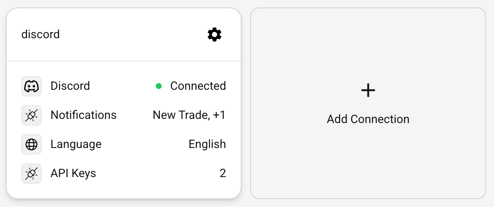
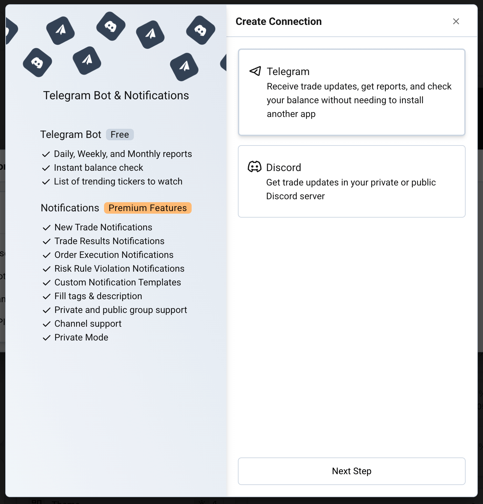
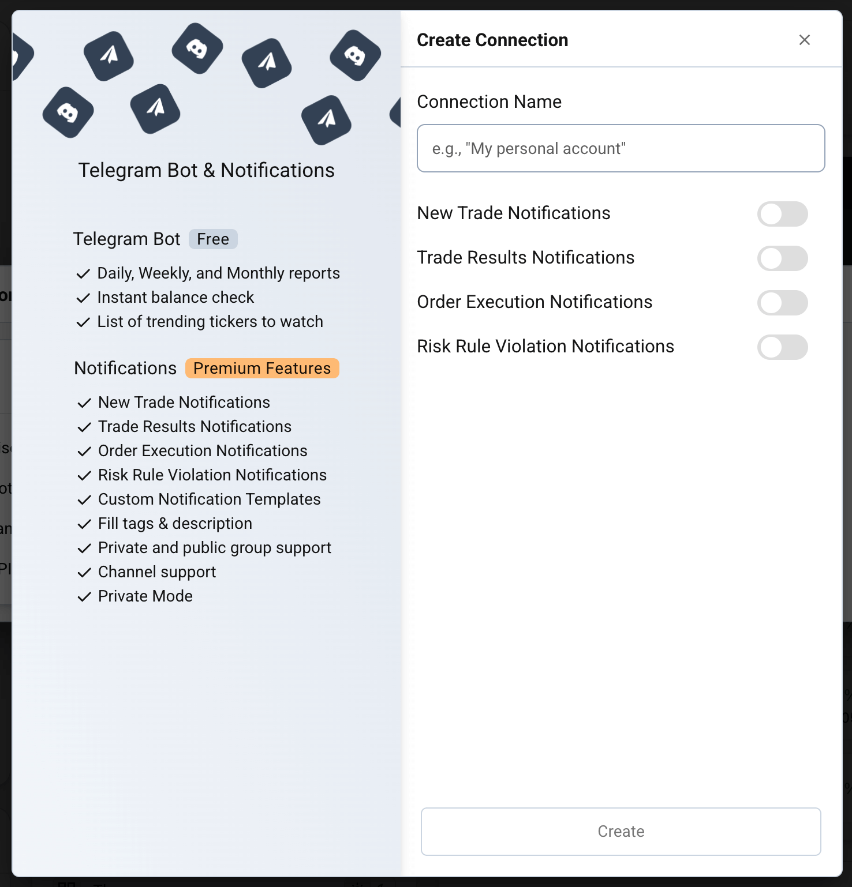
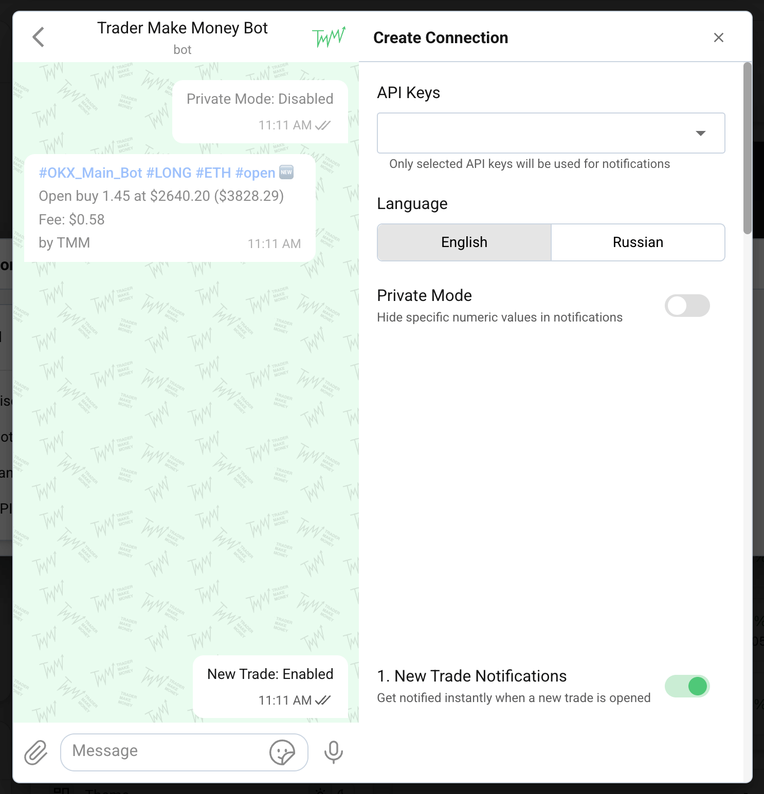
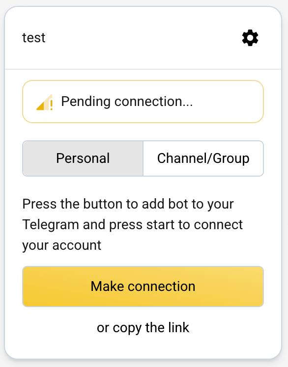
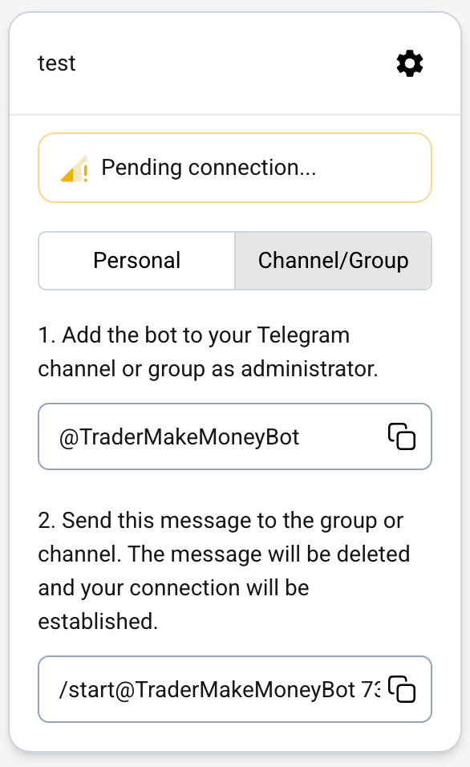
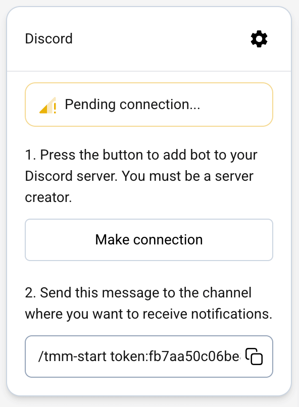
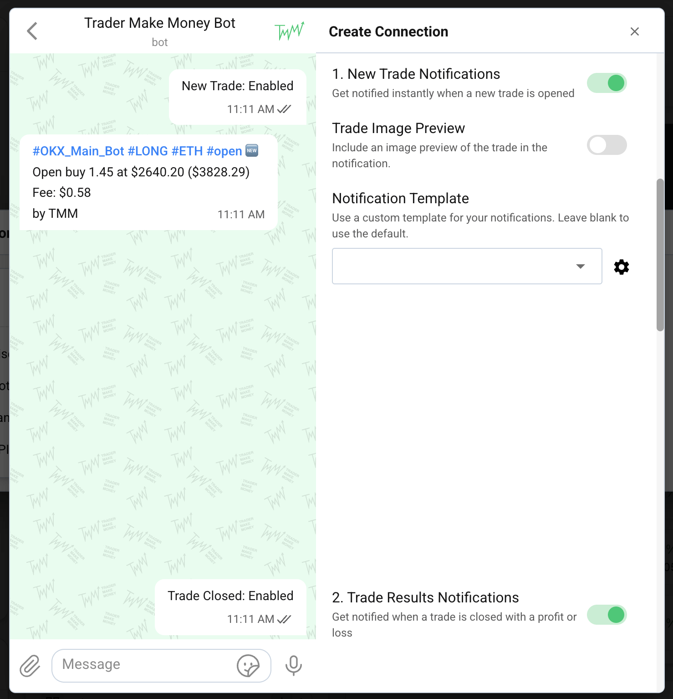
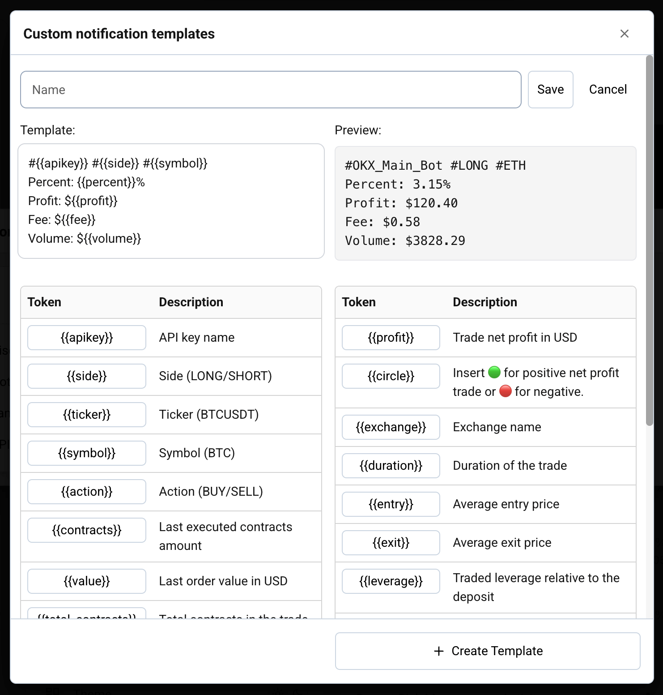

# Connections <a target="_blank" href="https://tradermake.money/app2/settings/?tab=connections" class="btn btn-header">Go to connections</a>

The "Connections" section is your central hub for integrating Trader Make Money with external services like Telegram and Discord. This allows you to receive real-time notifications, reports, and alerts directly where you communicate.

## Overview

From the Connections dashboard, you can manage all your active integrations, see which notifications are enabled for each, and quickly add new ones.

<picture>
  <source srcset="_media/connections/overview_dark.png" media="(prefers-color-scheme: dark)">
  
</picture>

---

## Setting Up a New Connection

Follow these steps to link a new service to your trading account.

<!-- panels:start -->
<!-- div:left-panel -->

### Step 1: Choose Your Service
Currently, you can connect your trading journal to:
- **Telegram**: Receive updates in your personal account, private groups, or public channels.
- **Discord**: Link to your private or public Discord server.

<!-- div:right-panel -->

<picture>
  <source srcset="_media/connections/step1_dark.png" media="(prefers-color-scheme: dark)">
  
</picture>
<em>Select service type</em>

<!-- panels:end -->

<!-- panels:start -->
<!-- div:left-panel -->

### Step 2: Basic Configuration
Give your connection a recognizable name (e.g., "Main Personal Telegram" or "Trading Group Discord"). 

Select the types of notifications you want to receive:
- **New Trade**: Instant alert when a position is opened.
- **Trade Results**: Summary of profit/loss when a trade closes.
- **Order Execution**: Detailed log of every buy/sell order.
- **Risk Rule Violation**: Real-time alerts when your [Risk Management](risk-management.md) boundaries are hit.

<!-- div:right-panel -->

<picture>
  <source srcset="_media/connections/step2_dark.png" media="(prefers-color-scheme: dark)">
  
</picture>
<em>Connection name and notification types</em>

<!-- panels:end -->

<!-- panels:start -->
<!-- div:left-panel -->

### Step 3: Granular Settings
Fine-tune how and what data is sent for this specific connection:

- **API Keys**: Choose which accounts should trigger notifications for this connection.
- **Language**: Select the language for your notification messages.
- **Private Mode**: If enabled, specific numeric values (like exact $ profit) will be hidden—perfect for public channels or sharing with others.

<!-- div:right-panel -->

<picture>
  <source srcset="_media/connections/step3_dark.png" media="(prefers-color-scheme: dark)">
  
</picture>
<em>Language and API key selection</em>

<!-- panels:end -->

---

## Finalizing the Connection

After clicking **Create**, you will receive specific instructions to finalize the link between our platform and your chosen service.

### Telegram Connections

<!-- panels:start -->
<!-- div:left-panel -->

#### Personal Chat
1. Click the **Make connection** button.
2. You will be redirected to the Telegram app.
3. Press **Start** to link your account.

<!-- div:right-panel -->

<picture>
  <source srcset="_media/connections/telegram_connect_personal_dark.png" media="(prefers-color-scheme: dark)">
  
</picture>
<em>Telegram personal connection</em>

<!-- panels:end -->

<!-- panels:start -->
<!-- div:left-panel -->

#### Groups and Channels
1. Add `@TraderMakeMoneyBot` to your group or channel as an **Administrator**.
2. Copy the unique `/start` command provided in the instructions.
3. Paste and send it in the group/channel.

> **Crucial Gotcha**: You **must** send the connection message as your **personal account**. If you send it while using Telegram's "Anonymous Admin" or "Post as Channel" feature, the connection will fail.

<!-- div:right-panel -->

<picture>
  <source srcset="_media/connections/telegram_connect_group_dark.png" media="(prefers-color-scheme: dark)">
  
</picture>
<em>Telegram group connection</em>

<!-- panels:end -->

### Discord Connections

<!-- panels:start -->
<!-- div:left-panel -->

1. Click the **Make connection** button (you must be the server creator).
2. Authorize the bot to join your server.
3. Copy the unique `/tmm-start` command provided.
4. Paste it into the specific **channel** where you want to receive notifications.

> **Privacy Note**: The bot will respond with a hidden confirmation message that only you can see. Other members of the server will not see that you've sent the command or that the connection has been established.

<!-- div:right-panel -->

<picture>
  <source srcset="_media/connections/discord_connect_dark.png" media="(prefers-color-scheme: dark)">
  
</picture>
<em>Discord connection steps</em>

<!-- panels:end -->

---

## Advanced Notification Features

Customization allows you to make your notifications as detailed or as minimal as you prefer.

<!-- panels:start -->
<!-- div:left-panel -->

### Visuals and Templates
For each notification type, you can toggle additional features:

- **Trade Image Preview**: Include a screenshot of the trade's chart and execution points directly in the message.
- **Notification Template**: Use the default layout or create a fully custom message using our template engine.

<!-- div:right-panel -->

<picture>
  <source srcset="_media/connections/step4_dark.png" media="(prefers-color-scheme: dark)">
  
</picture>
<em>Template and image settings</em>

<!-- panels:end -->

### Custom Notification Templates

"Make your notifications yours." Our template engine uses **tokens** that are automatically replaced with real trade data.

- **Flexible Layout**: Rearrange the order of information to suit your needs.
- **Emoji Support**: Add icons to quickly identify trade types (Long/Short) or results (Profit/Loss).
- **Available Tokens**: Use tokens like `{{apikey}}`, `{{side}}`, `{{ticker}}`, `{{profit}}`, and many more to build your perfect alert.

<picture>
  <source srcset="_media/connections/new-custom-template_dark.png" media="(prefers-color-scheme: dark)">
  
</picture>
<em>Custom template editor</em>
