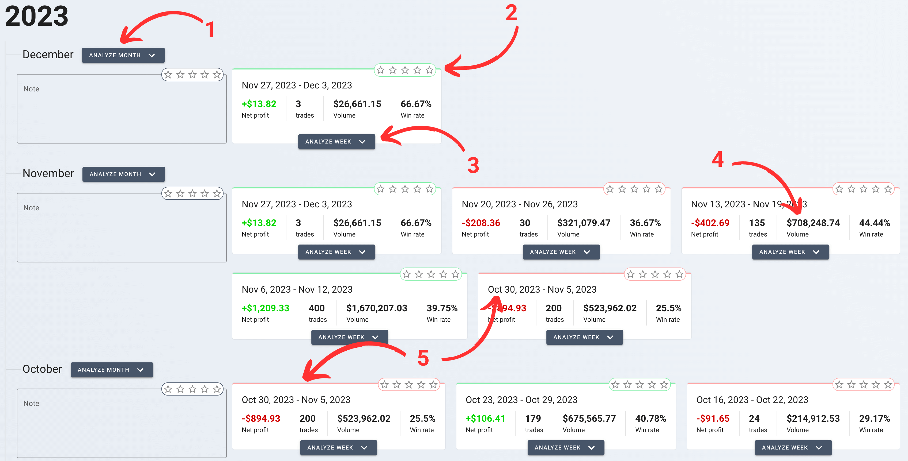
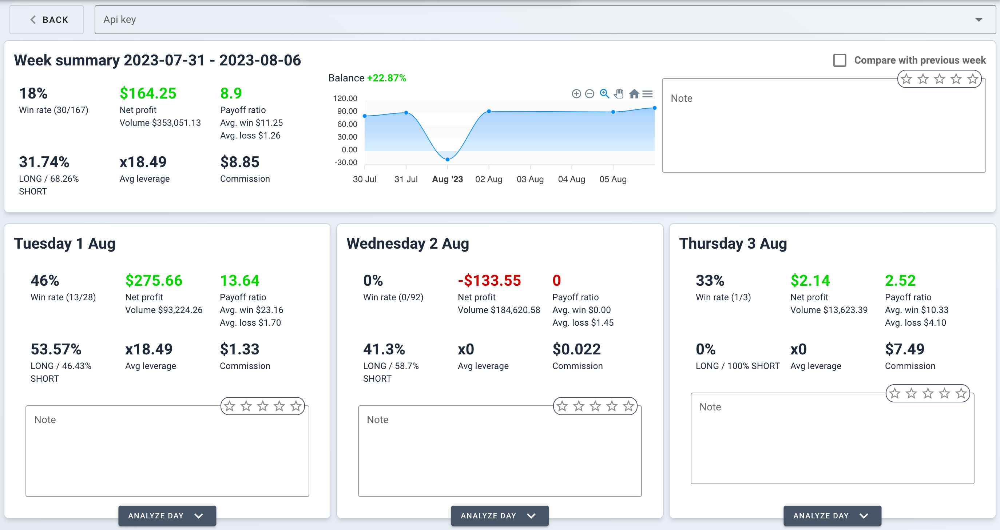
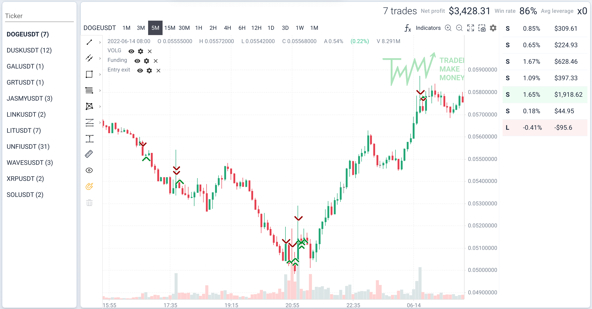

# The "Diary": Your Automated Reflection Tool

The "Diary" section was meticulously crafted to offer an effortless,
zero-configuration experience for traders who prefer a straightforward review
over customizable analytics found in the "Summary" section.

## Example

<picture> <source srcset="_media/diary/diary-dark.png"
    media="(prefers-color-scheme: dark)"> 
</picture>

1. Analyze all trades on one chart for entire month
2. Rate your trading
3. Analyze each day of week in details
4. Aggregated volume including buy and sell orders
5. Some weeks may appear in two different months if they straddle the end and
   start of consecutive months, ensuring no trading day is overlooked.

## The Importance of Reflection in Trading

Reflection is a cornerstone of trading discipline, enabling you to:

- **Learn from the Past**: By revisiting successful and unsuccessful trades, you
  avoid repeating mistakes and reinforce winning strategies.
- **Adapt and Evolve**: Continuous reflection helps you adapt to market changes
  and evolve your trading methods.
- **Maintain Emotional Equilibrium**: Regularly reviewing your trading diary
  assists in managing the emotional highs and lows associated with trading.

The "Diary" is designed to be your trading journal, providing an uncluttered
space for daily, weekly, and monthly reflection, helping to build a history of
your trading journey.

## Best Practices for Using the "Diary"

- **Daily Notes**: After each trading session, jot down key observations and
  thoughts.
- **Weekly Summaries**: At the end of the week, summarize your insights to
  capture the essence of your strategies and results.
- **Monthly Reflections**: Once a month, review your weekly notes to form a
  broader analysis of your trading patterns.

# Navigating the "Diary" Section

## Monthly Overview

- **Snapshot**: Get a bird's eye view of your trading performance with weeks
  grouped by month.
- **Note-Taking**: Add reflections for each month, informing your broader
  trading strategy.
- **Week Duplication**: Some weeks may appear in two different months if they
  straddle the end and start of consecutive months, ensuring no trading day is
  overlooked.

## Weekly Analysis

<picture> <source srcset="_media/diary/diary-week-dark.png"
    media="(prefers-color-scheme: dark)"> 
</picture>

- **Weekly Breakdown**: Click on "Analyze Week" to drill down into each day's
  performance within that week.
- **Custom Notes**: Provide context to your weekly statistics with personalized
  notes and a star rating reflecting your satisfaction with the week's trading.

## Daily Details

<picture> <source srcset="_media/diary/diary-day-dark.png"
    media="(prefers-color-scheme: dark)"> 
</picture>

- **In-Depth Chart**: Select "Analyze Day" to review all trades for that day,
  presented in a chart grouped by ticker symbol.
- **Profit and Loss Indicators**: Easily identify your most and least profitable
  trades with a color-coded profit/loss list.
- **Daily Reflections**: Write specific notes for the day to capture immediate
  insights or rationales behind each trade.

## Month View

- **Extended Analysis**: The month view operates similarly to the day view,
  aggregating data for the entire month, offering a longer-term perspective of
  your trading habits and outcomes.
- **Consistent Recording**: Maintain regular note-taking habits, as you do on a
  weekly and daily basis, to ensure a comprehensive understanding of monthly
  trends.
