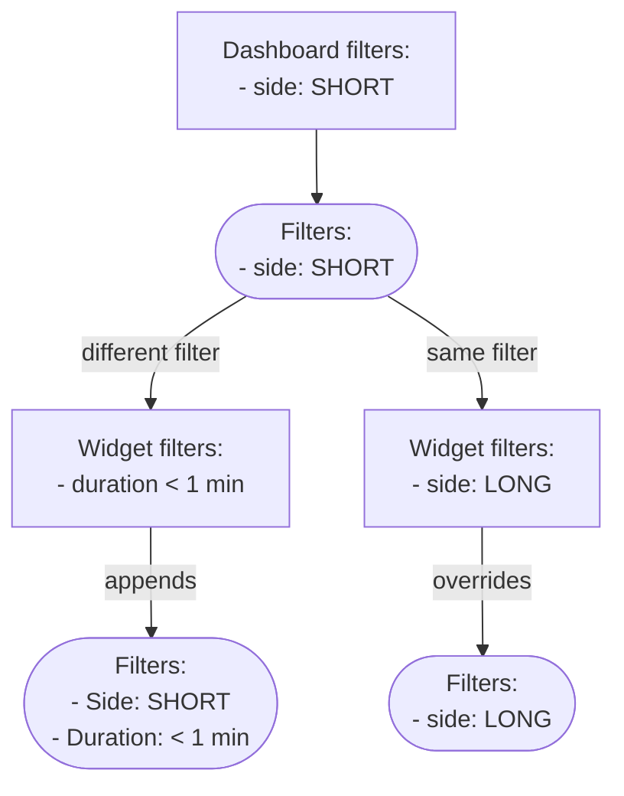
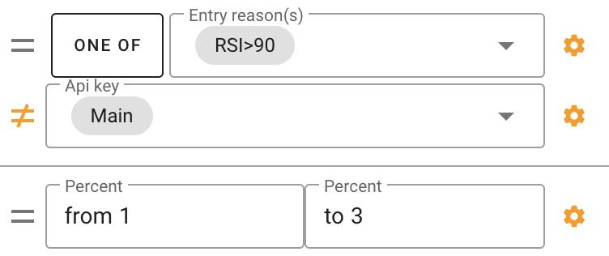

# Understanding Data Filtering

## The Essence of Filters

Filters are instrumental in analyzing trades as entire entities, without delving
into individual orders. This is particularly crucial for understanding multi-day
trades. For example, a trade opened and closed on different days will show
profit on the day it was opened by default. This nuance underlines the
importance of the 'Grouping Date' filter. This behavior can be changed in
profile settings as well.

## Managing Filter Presets

<!-- panels:start -->
<!-- div:left-panel -->

### Creating a Filter Preset

1. **Set Your Filters**: Apply the filters you want in the 'Summary' or 'My
   Trades' section.
2. **Save as Preset**: Click 'Save Preset' and name your new preset.

<!-- div:right-panel -->

<picture >
    <source srcset="_media/filters/preset-dark.png"
    media="(prefers-color-scheme: dark)"> 
</picture>
<em>Save preset</em>

<!-- panels:end -->

<!-- panels:start -->
<!-- div:left-panel -->

### Making a Preset Your Favorite

- **Select Favorite**: Next to your saved presets, click the 'star' icon to mark
  a preset as your favorite.
- **Automatic Application**: Your favorite preset will automatically be applied
  each time you visit the section.

<!-- div:right-panel -->

<picture >
    <source srcset="_media/filters/favorite-dark.png"
    media="(prefers-color-scheme: dark)"> 
</picture>
<em>Presets list</em>

<!-- panels:end -->

By using presets, you can quickly access your preferred filter configurations,
making your data analysis more efficient.

## Filtering in Widgets

### Hierarchical Application of Filters

<!-- panels:start -->
<!-- div:left-panel -->

- **Top-Down Approach**: Settings applied at the dashboard level affect all
  widgets.
- **Widget-Specific Overrides**: Individual widget settings can override
  dashboard settings for customized analysis.

<!-- div:right-panel -->

<!-- panels:end -->

## Data Grouping

<!-- panels:start -->
<!-- div:left-panel -->

**Default value:** by date

If you're looking to analyze your trading performance with a broad perspective,
use 'Group Data' by month or week for an overall view.

Conversely, if you require a detailed analysis to scrutinize individual trades
and patterns, group the data by hour or minute to zoom in on the specifics of
your trading activity.

<!-- div:right-panel -->

> **Attention!** The service uses the time zone specified in your profile
> settings. If you want your statistics to match the exchange's time, please
> change your time zone to UTC.

<!-- panels:end -->

## Trade Opening/Closing Date

By default, the "opening" date of the trade is used. This is not always
convenient if you have trades that last longer than 1 day, as the profit will be
shown on the day of opening.

You can change this in the "Date Grouping" filter for each widget separately or
in the [profile settings](settings.md) for the entire account.

## Customization

<!-- panels:start -->
<!-- div:left-panel -->

When you hover the mouse over most of the filters, a gear icon appears on the
right. Clicking on this icon activates the manual input mode for the filter
value.

The "=" icon, upon clicking, switches to "≠" mode and excludes trades that fall
under the specified filter parameters.

Some filters (for example, "Entry Reasons") also have a "one of" / "all of"
button. If you select "one of", trades with at least one of the chosen entry
reasons will be selected. If "all of" is chosen, then all the entry reasons must
be present in the trade.

<!-- div:right-panel -->

<picture>
    <source srcset="_media/filters/custom-dark.png"
    media="(prefers-color-scheme: dark)"> 
</picture>
<em>Filters Customization</em>

<!-- panels:end -->

## Time Presets

You can select a time period (current day, previous day, current week, previous
week, current month, etc.). Once this period is selected, you no longer need to
change it. The period will automatically update.

For example, if you choose the current week, the data will reset every Monday.
