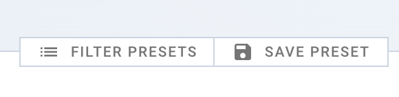
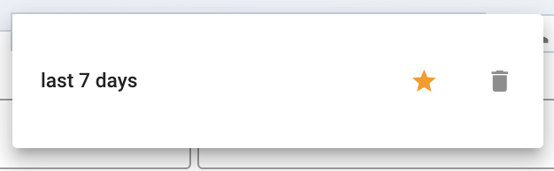

# Understanding Data Filtering

## The Essence of Filters

Filters are instrumental in analyzing trades as entire entities, without delving
into individual orders. This is particularly crucial for understanding multi-day
trades. For example, a trade opened and closed on different days will show
profit on the day it was opened by default. This nuance underlines the
importance of the 'Grouping Date' filter. This behavior can be changed in
profile settings as well.

## Managing Filter Presets

<!-- panels:start -->
<!-- div:left-panel -->

### Creating a Filter Preset

1. **Set Your Filters**: Apply the filters you want in the 'Summary' or 'My
   Trades' section.
2. **Save as Preset**: Click 'Save Preset' and name your new preset.

<!-- div:right-panel -->

<picture >
    <source srcset="_media/filters/preset-dark.png"
    media="(prefers-color-scheme: dark)"> 
</picture>
<em>Save preset</em>

<!-- panels:end -->

<!-- panels:start -->
<!-- div:left-panel -->

### Making a Preset Your Favorite

- **Select Favorite**: Next to your saved presets, click the 'star' icon to mark
  a preset as your favorite.
- **Automatic Application**: Your favorite preset will automatically be applied
  each time you visit the section.

<!-- div:right-panel -->

<picture >
    <source srcset="_media/filters/favorite-dark.png"
    media="(prefers-color-scheme: dark)"> 
</picture>
<em>Presets list</em>

<!-- panels:end -->

By using presets, you can quickly access your preferred filter configurations,
making your data analysis more efficient.

## Filtering in Widgets

### Hierarchical Application of Filters

<!-- panels:start -->
<!-- div:left-panel -->

- **Top-Down Approach**: Settings applied at the dashboard level affect all
  widgets.
- **Widget-Specific Overrides**: Individual widget settings can override
  dashboard settings for customized analysis.

<!-- div:right-panel -->

<!-- panels:end -->
