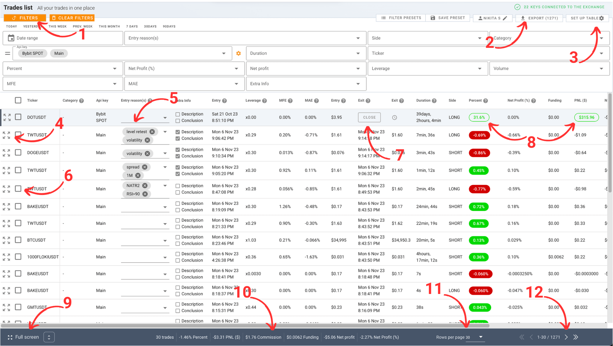
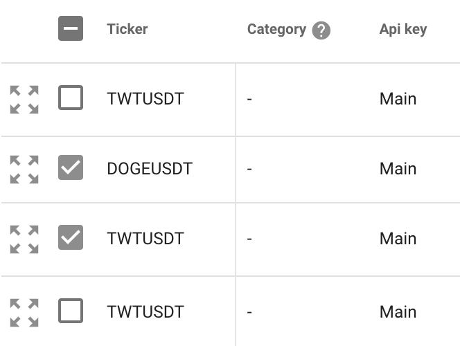
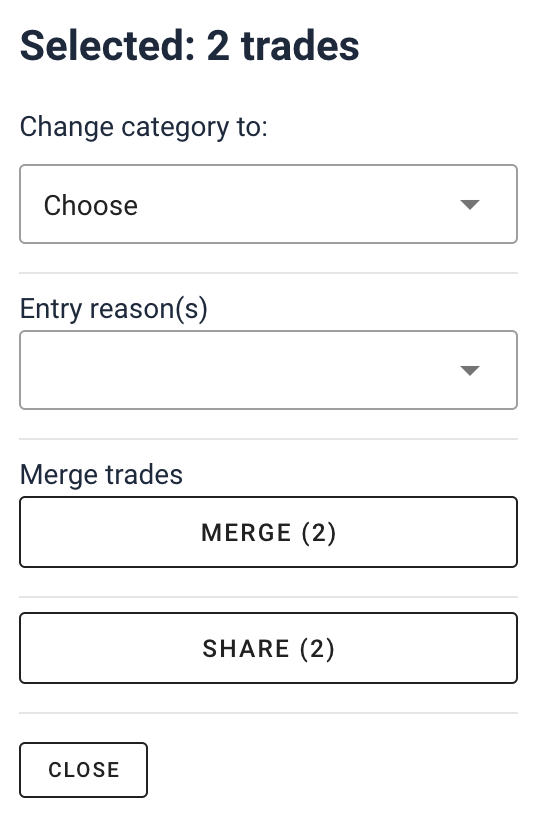

# Your Guide to analyzing trades

Welcome to the 'My Trades' section, where you'll see a list of your trades
sorted by the opening date. Open trades on the exchange are always listed first.

Unlike the 'Summary' section where you analyze your overall trading, here you
can delve into each trade individually.

## Example

<picture > <source srcset="_media/my-trades/my-trades-dark.png"
    media="(prefers-color-scheme: dark)">  </picture>

1. Open/Close filters
2. Export to CSV
3. Table configuration
4. Open trade details (with chart)
5. Add/Create/Remove trade entry reason
6. Select trade
7. Close trade manually (only for SPOT markets)
8. Outlined indicator of open trade
9. Switch trade opening mode
10. Summary for the current page trades
11. Amount of trades per page **Performance Impact**: Be aware that
    selecting a higher number of trades to display can impact the performance
    and responsiveness of the system
12. Pagination

#### Recording Entry Reasons

Every trade has a reason behind its execution. Regularly recording this reason
helps you identify effective and ineffective trading strategies. It also
prevents you from making trades without a solid reason.

#### Utilizing Entry Reason Tags

Use the 'Entry Reasons' column for short, repetitive tags. By creating your set
of tags, you'll gradually move away from manually typing reasons to selecting
from your personalized list.

#### Detailed Trade Analysis

In-depth analysis of individual trades is a crucial step in any trader's
development. Therefore, completing the description and conclusion for each trade
is an essential task.

This approach in 'My Trades' allows you to dissect your trading habits and
decisions on a granular level, leading to more informed and disciplined trading
strategies.

### Filters

Optimize your analysis with powerful filtering:

1. **Access Filters**: Click 'FILTERS' to unveil various criteria.
2. **Apply and Customize**: Choose from date ranges, PNL, trade duration, etc.,
   to filter trades.
3. **Saving Presets**: Save your filter settings as presets for future use.
   Favorite a preset for automatic application on your return.

Read [data filtering](filters.md#understanding-data-filtering) section.

## Exporting Trades

Effortlessly export your trading data:

1. **Prepare for Export**: Use filters to select the trades you want to export.
2. **Export**: Hit the 'EXPORT' button to download a CSV file of your filtered
   trades. [[\#2]](#example)
3. **Opening CSV Files**: If unable to open the CSV, use
   [sheets.new](https://sheets.new)

## Table setup

Personalize your trades table for optimal analysis:

1. **Accessing Table Settings**: To customize your table view, navigate to your
   profile settings.
2. **Customization Options**: In the profile settings, you can:
   - Rearrange the order of columns to suit your preference.
   - Enable or disable specific columns, focusing only on the information that's
     important to you.

## Trade Viewing Mode

'My Trades' offers two modes for viewing trade details, tailored to your viewing
preferences:

**Changing the Mode**: Look for the mode selection buttons at the lower left
corner of the trades table [[#9]](#example)

1. **Fullscreen Mode**: This mode is especially useful for smaller screens,
   providing a clear and focused view of each trade.
2. **Dropdown Mode**: Convenient for quick reviews within the context of the
   trades list, allowing you to maintain an overview of all trades.

Feel free to switch between these modes depending on how you wish to analyze
your trades at any given moment.

## Keyboard Shortcuts

Enhance your trading analysis with these keyboard shortcuts, designed for quick
and efficient navigation through your trades:

- <kbd>Space</kbd>: Toggle the expansion of a trade's details.
- <kbd>↓</kbd> or <kbd>TAB</kbd>: Move to the next trade in the list. If you're
  on the last trade, this will advance to the next page.
- <kbd>↑</kbd>: Move to the previous trade. If you're on the first trade, this
  will go back to the previous page.
- <kbd>Enter</kbd> or <kbd>Return</kbd>: Jump into typing the entry reason for
  the selected trade. Once you're done, hit <kbd>TAB</kbd> to complete and move
  to the next trade.

## Bulk Actions

<!-- panels:start -->
<!-- div:left-panel -->

Bulk actions simplify managing multiple trades at once:

1. **Selecting Trades for Bulk Actions**:

- Use the checkboxes next to each trade to select individual trades.
- Select all trades on the page by clicking the checkbox in the table header.

<!-- div:right-panel -->

<picture> <source srcset="_media/my-trades/select-dark.png"
    media="(prefers-color-scheme: dark)">  </picture> <em>Select trades</em>

<!-- panels:end -->

<!-- panels:start -->
<!-- div:left-panel -->

2. **Available Bulk Actions**:

- **Change Category**: Move selected trades to a different category, such as
  'Archive', to organize your view.
- **Merge Trades**: Combine selected trades that match in API key, ticker, and
  side, provided they are all closed.
- **Edit Entry Reasons**: Apply or modify entry reasons to all selected trades
  at once.
- **Bulk Share**: Generate a single link to share the selected trades.

<!-- div:right-panel -->

<picture> <source srcset="_media/my-trades/bulk-dark.png"
    media="(prefers-color-scheme: dark)">  </picture> <em>Bulk actions popup</em>

<!-- panels:end -->

## Start from scratch (Archive)

### What is the Archive Category?

The Archive category lets you hide trades from statistical calculations and
views on the platform. It's a way to organize or 'start over' with your trading
data without deleting your history.

<!-- panels:start -->
<!-- div:left-panel -->

### Archiving All Trades

To move all trades to the Archive:

1. Go to 'Profile Settings'.
2. Click 'Archive All Trades'.

<!-- div:right-panel -->

> **Remark on Public Profile:**
>
> Archiving trades doesn't affect statistics in the Public Profile. To reset
> stats in PP, you need to delete your API key and create a new account on the
> exchange. Adding new key from the same account will redownload all the trades
> again.

<!-- panels:end -->

### Moving Selected Trades to Archive

Check [bulk actions](#bulk-actions) section for detailed guide.

1. Select trades in the 'My Trades' table.
2. Click 'Change Category' to 'Archive'.

### Retrieving Trades from Archive

1. In 'My Trades', open filters and select 'Archive'.
2. Choose trades and select 'Change Category' to 'No Category'.

## Sharing Trades

Easily share insights from your trading journey:

1. **Single Trade Sharing**:

   - Expand a trade and click the 'Share' button to generate a unique link for
     that specific trade.

2. **Bulk Trade Sharing**:
   - Select multiple trades using the checkboxes.
   - Use the 'Share' option to create a single link that shares all selected
     trades.

### Configuring Profit Display

Control how your profit is displayed when sharing:

1. **Enabling Public Profile**:

   - Go to your profile settings and enable your public profile.

2. **Show Profit**:
   - In your public profile settings, find and enable the option to display
     profit.
   - Remember, by default, profit figures are not shown in shared trades. This
     setting must be enabled for profit in $ to be visible in shared trades.

## Table Columns Explained

> You can disable columns or change order/apperance [table setup](#table-setup)

1. **Ticker**: Symbol of the traded asset for example "BTCUSDT".
2. **Leverage**: The leverage used, relative to account balance. **\***
3. **Net Profit**: Realized PNL minus commission, funding and any other fees.
4. **Entry**: The time when the trade was opened.
5. **Average Price Entry**: The weighted average price at which the trade was
   entered.
6. **Exit**: The time when the trade was closed.
7. **Average Price Exit**: The weighted average price at which the trade was
   exited.
8. **Duration**: The time elapsed between the entry and exit of the trade.
9. **Side**: Indicates whether the trade was a long or short position.
10. **Percent**: The percentage change from the average entry point to the
    average exit point.
11. **Funding**: Funding fees associated with the trade.
12. **Net Profit (%)**: The net profit relative to the deposit. **\***
13. **PNL ($)**: Realized profit or loss in dollars.
14. **Qty**: The total quantity of contracts in the trade.
15. **Peak Qty**: The maximum one-time volume of the trade.
16. **Volume**: Total volume of the trade in USD.
17. **Commission**: Fees or commissions paid for the trade.
18. **Entry Reason(s)**: Tags or reasons you've assigned for entering the trade.
19. **Extra Info**: Convenient way to find trades with empty description or
    conclusion.
20. **Category**: The category you've assigned to the trade.
21. **MAE (Maximum Adverse Excursion)**: The maximum price movement against the
    trade during its duration.
22. **MFE (Maximum Favorable Excursion)**: The largest observed profit during
    the trade.

**\*** - _It's calculated for trades opened after the API key was added to our
system, as most exchanges do not provide historical balance data._

#### 🔒 **Note on Payment Plan Restrictions**:

- Certain columns are exclusive to specific payment plans.
- If a column is not included in your plan, you will see a lock(🔒) icon in
  place of values.
- To access these locked columns, consider upgrading to a plan that includes
  them.

## MAE and MFE

#### MAE (Maximum Adverse Excursion)

- **What is MAE?**: Measures how far the price moved against your position
  during the trade.
- **How it's Calculated**: Evaluates the worst price point relative to your
  first entry point (lowest for longs, highest for shorts).

#### MFE (Maximum Favorable Excursion)

- **What is MFE?**: Calculates the maximum potential profit during a trade.
- **Calculation Method**: Identifies the best price point from your entry
  (highest for longs, lowest for shorts).

#### Calculation Specifics and Limitations

- **Timeframe**: Derived from the 1-minute chart.
- **Limitation**: Trades under 1 minute are not included.
- **Future Enhancements**: Plans to upgrade to second-chart data for more
  detailed analysis.

MAE and MFE are key metrics for assessing risk and potential profit, helping
traders, especially beginners, make informed decisions.

## Trade Lifecycle

### Futures Market

- **Starting a Trade**: A trade begins with a buy or sell order.
- **Accumulating**: Additional orders on the same side are added to the open
  trade.
- **Closing a Trade**: Opposite side orders close the position.

**Example**:

1. Buy 2 BTC
2. Buy additional 1 BTC
3. Sell 1 BTC (position is now 2 BTC)
4. Sell 2 BTC (trade closes).

### Spot Market

- **Initiating Trades**: Starts with a buy or sell and accumulates further
  orders on the same side.
- **Automatic Closure**: System closes the trade if "dust" remains due to
  minimum order sizes.
- **Manual Closure**: The "Close Trade" button allows you to close trades with
  residual amounts.

**Example**:

1. Buy 100 XRP
2. Buy 50 XRP more
3. Sell 120 XRP (30 XRP remains)
4. Sell 30 XRP or manually close if the amount is too small to trade ("dust").

**Manual Closing Note**: Closing a trade manually without any sell orders moves
it to the archive, as it's classified as a conversion.

Use "Close Trade" cautiously; it's a permanent action with immediate effect on
trade categorization.
