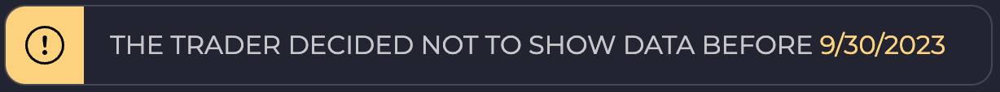
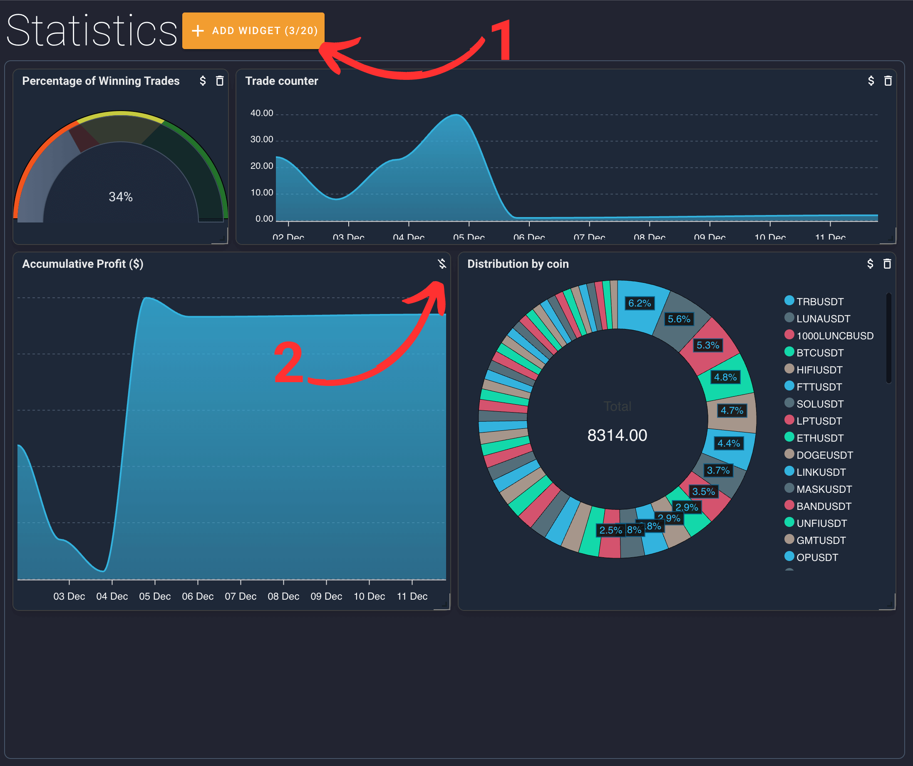
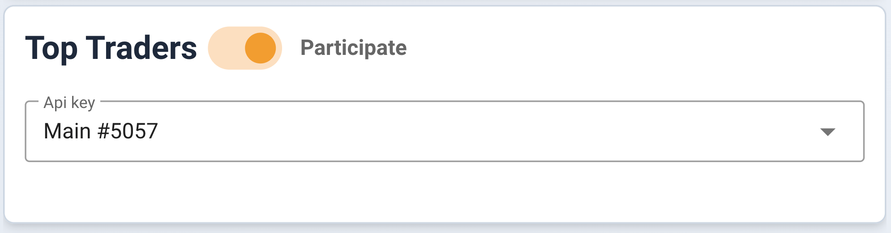
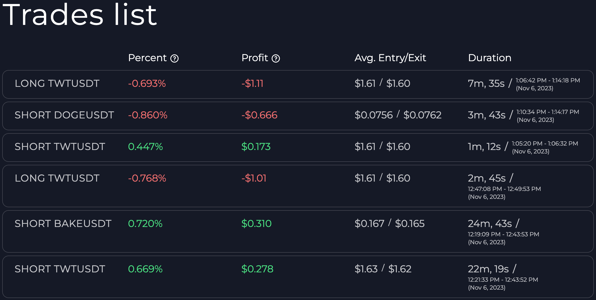
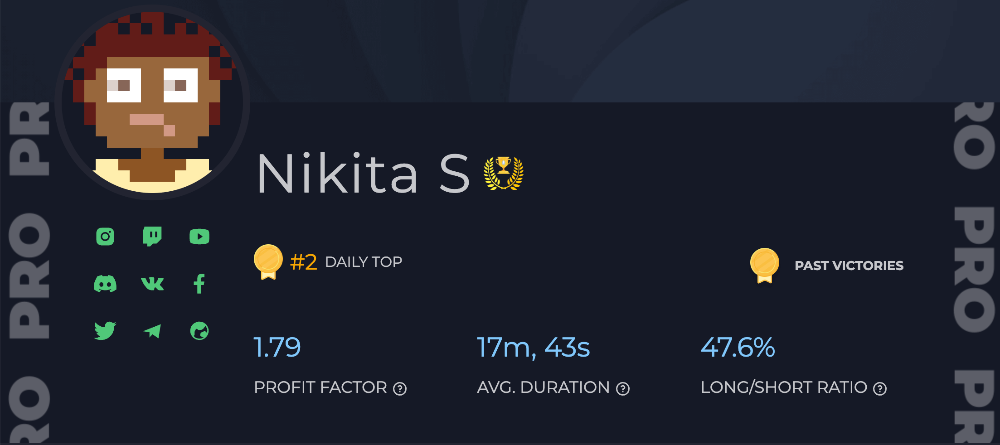
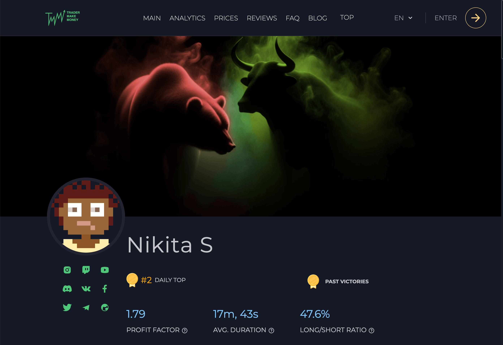

# Public Profile <a target="_blank" href="https://tradermake.money/app2/account/risk-management" class="btn btn-header">Go to public profile</a>

### What is a public profile?

<!-- panels:start -->
<!-- div:left-panel -->

A public profile is your personal trading business card, consisting of:

- A profile with contact information and description.
- A fully customizable dashboard with widgets.
- A list of all your trades.

<!-- div:right-panel -->

> Cumulative Profit ([private](summary.md#private-mode) version) is a mandatory
> widget that helps us combat dishonest traders.
>
> This widget does not reveal how much the trader has earned, but it allows
> instant identification of whether the trader is profitable and the overall
> trend.

<!-- panels:end -->

## How to Hide a Trade(s)?

You can't. A public profile only makes sense if no one can hide or conceal any
of the trades. Therefore, in TMM, we do not provide the option to choose which
trades are displayed in the public profile. However, this doesn't mean you can't
start over, more on that below.

## How to Start Over?

<!-- panels:start -->
<!-- div:left-panel -->

In the public profile settings, you can choose to "start public history from".
All trades before this date will be hidden, but your profile will receive a
warning that you have decided to hide all trades up to a certain date.

<!-- div:right-panel -->

<picture>  </picture> <em>Warning example</em>

<!-- panels:end -->

## Widgets in the Public Profile

<!-- panels:start -->
<!-- div:left-panel -->

<picture>  </picture> <em>Widgets setup</em>

<!-- div:right-panel -->

1. Adding a widget
2. Making a widget [private](summary.md#private-mode) (hide absolute values)

In the public profile, you can add almost all widgets available in the
["Summary"](summary.md) section. The only limitation is that you cannot use any
[filters](filters.md) to alter the output.

<!-- panels:end -->

## Top Traders

<!-- panels:start -->
<!-- div:left-panel -->

To participate in the top traders ranking, you need to enable the toggle next to
the "Top Traders" title and select one API key. Only one API key can participate
in the [top traders](top-traders.md) ranking.

<!-- div:right-panel -->

<picture> <source srcset="_media/public-profile/top-traders-dark.png"
    media="(prefers-color-scheme: dark)"> </picture> <em>Top traders toggle</em>

<!-- panels:end -->

## List of Trades

<!-- panels:start -->
<!-- div:left-panel -->

By default, the list of trades is completely disabled. You can choose one of 3
options:

- Show all trades
- Show closed trades only
- Show open trades only

If you decide to enable trades, you have the option to disable the display of
additional data (descriptions, outputs, entry reasons, screenshots, etc.).

You can limit the list and show trades for the last day, 7, 30, 90 days.

<!-- div:right-panel -->

<picture>  </picture> <em>Trades list example</em>

<!-- panels:end -->

## How to Get a "PRO" Profile?

<!-- panels:start -->
<!-- div:left-panel -->

A trader who enters the
[PRO League](top-traders.md#how-to-get-into-the-pro-league) in the top traders
receives a special background for their public profile. This background cannot
be obtained in any other way.

<!-- div:right-panel -->

<picture>  </picture> <em>PRO background</em>

<!-- panels:end -->

## Customization

<!-- panels:start -->
<!-- div:left-panel -->

In your public profile, you can change the background of the page by uploading
an image (in png/jpg/jpeg format). The recommended size for the background is
1920x500px.

You can change your avatar in the profile settings.

You can add any of your social networks if you want other users to be able to
contact you.

> Want a cool background like this?
> <a href="_media/public-profile/TMM-BULL-BEAR-BG.png" target="blank">Yes, I
> do!</a>

<!-- div:right-panel -->

<picture>  </picture> <em>Custom background</em>

<!-- panels:end -->

### Disclaimer

Posting indecent/offensive pictures and/or profile descriptions can lead to the
banning of your public profile. Please refer to the
[terms of use](https://tradermake.money/terms-and-conditions) for more details.
