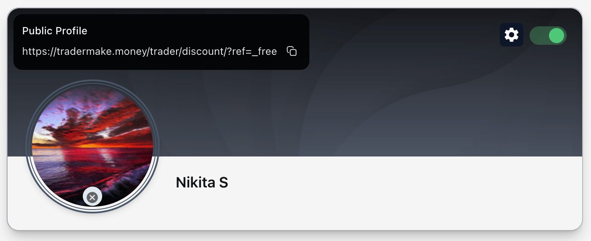
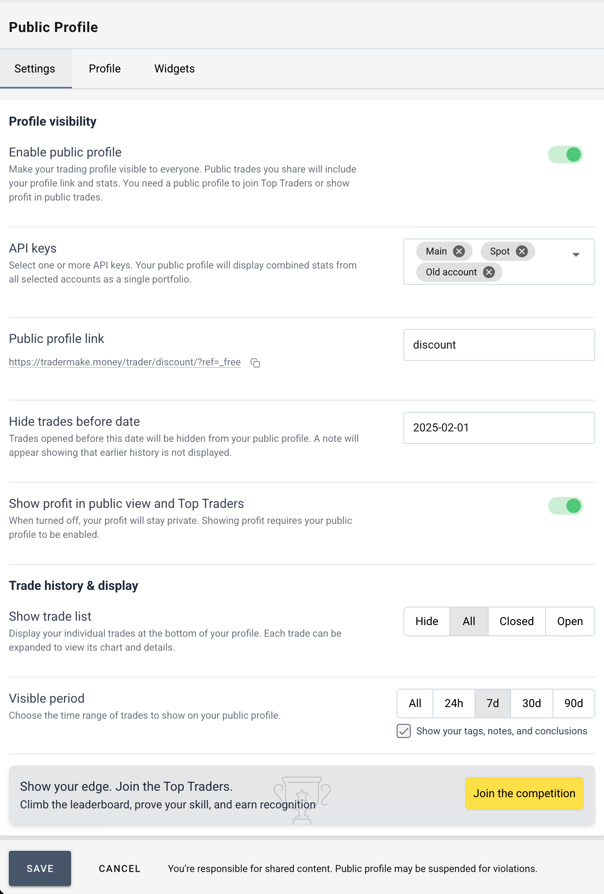
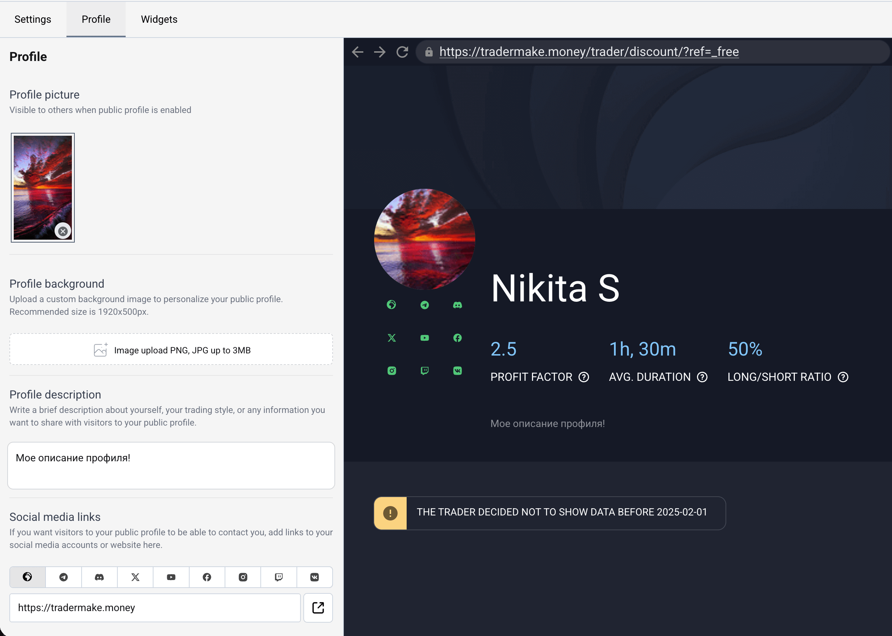
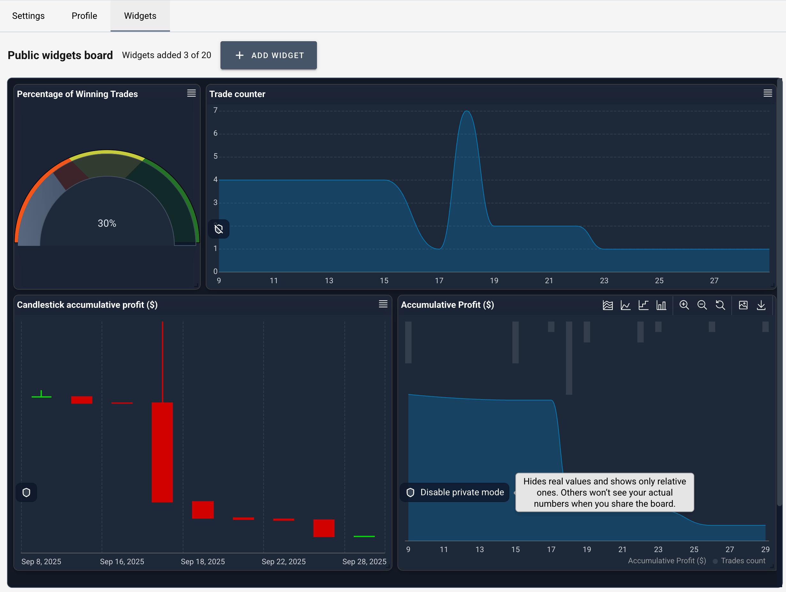
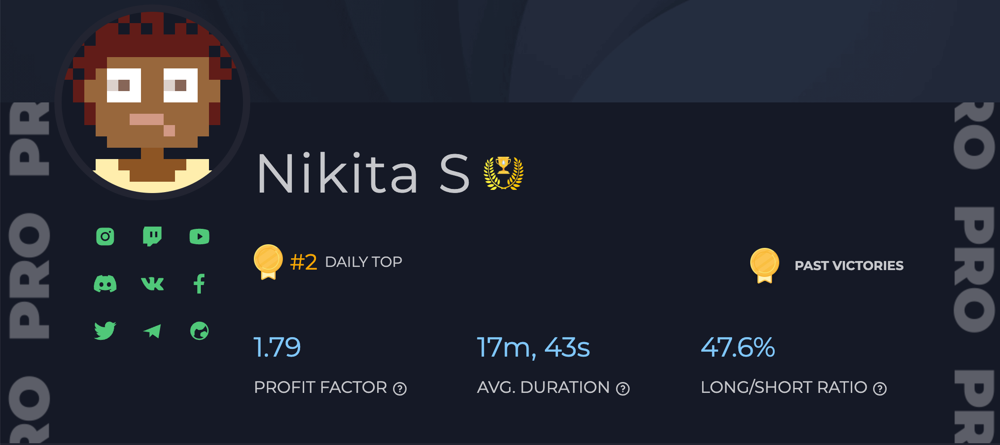

# Public Profile <a target="_blank" href="https://tradermake.money/app2/settings/?tab=public-profile" class="btn btn-header">Go to public profile</a>

A public profile is your personal trading business card. It allows you to showcase your performance, build a reputation, and compete with other traders while maintaining full control over what data is revealed.

Your public profile consists of:
- **Bio & Social Links**: A profile with your contact information and trading philosophy.
- **Custom Widgets**: A fully customizable dashboard showing your performance metrics.
- **Trade History**: An optional, verifiable list of your trades.

---

## How to Set Up

<!-- panels:start -->
<!-- div:left-panel -->

### 1. Enable from Settings
You can quickly enable or disable your public profile from the main **Settings** page. 

Click the **gear icon** on the Public Profile block to enter the advanced configuration mode, where you can fine-tune your visibility and appearance.

<!-- div:right-panel -->

<picture>
  <source srcset="_media/public-profile-v2/settings_block_dark.png" media="(prefers-color-scheme: dark)">
  
</picture>
<em>Settings page block</em>

<!-- panels:end -->

---

## Frequently Asked Questions

Can I hide specific trades from my profile?

No. To maintain transparency and trust within the community, you cannot hide or "cherry-pick" individual trades. You can only use the <strong>"Hide trades before date"</strong> setting to start your public history from a specific point in time.

Can I remove the Cumulative Profit widget?

No. The Cumulative Profit widget is mandatory for all public profiles. It ensures that viewers can see the overall trend and consistency of a trader, preventing the spread of misleading or partial performance data.

Can I apply filters to my public widgets?

No. Unlike the private Summary section, public widgets do not support custom filters. This ensures that the data shown is a true representation of the selected API keys' performance.

Does archiving trades in my journal affect my public profile?

No. Archiving trades only hides them from your private view. The public profile pulls data directly from the exchange via your API keys to ensure all stats are verifiable.

---

## Configuration Steps

### Step 1: Visibility & Data
In the **Settings** tab of the advanced configuration, you define the "rules" for your profile:

<!-- panels:start -->
<!-- div:left-panel -->

- **API Keys**: Choose which accounts to include in your public stats.
- **Custom Link**: Create a unique URL for your profile.
- **Hide History**: Set a "start public history from" date. All trades before this date will be hidden, but a note will appear on your profile indicating that earlier history is not displayed.
- **Profit Visibility**: Choose whether to show absolute profit values ($) or keep them private (showing only %).
- **Trade List**: Decide if you want to show all trades, only closed ones, or hide the list entirely.

<!-- div:right-panel -->

<picture>
  <source srcset="_media/public-profile-v2/step1_dark.png" media="(prefers-color-scheme: dark)">
  
</picture>
<em>Visibility settings</em>

<!-- panels:end -->

### Step 2: Profile Design
In the **Profile** tab, you can customize your "brand":

<!-- panels:start -->
<!-- div:left-panel -->

- **Visuals**: Upload a custom avatar and a wide background image (recommended 1920x500px).
- **Bio**: Write a description of your trading style.
- **Social Media**: Link your Twitter, Telegram, Discord, and other platforms so followers can reach you.
- **Live Preview**: See exactly how your profile looks as you make changes.

<!-- div:right-panel -->

<picture>
  <source srcset="_media/public-profile-v2/step2_dark.png" media="(prefers-color-scheme: dark)">
  
</picture>
<em>Profile customization</em>

<!-- panels:end -->

### Step 3: Public Widgets
Just like the [Summary](summary.md) section, you can build a custom dashboard for your public viewers:

<!-- panels:start -->
<!-- div:left-panel -->

- **Add Widgets**: Choose from a wide variety of charts and metrics.
- **Privacy Mode**: For sensitive widgets, you can enable [Private Mode](summary.md#private-mode) to show relative trends instead of exact numbers.
- **Mandatory Widget**: The **Accumulative Profit** widget is often used as a baseline to verify long-term consistency.

<!-- div:right-panel -->

<picture>
  <source srcset="_media/public-profile-v2/step3_dark.png" media="(prefers-color-scheme: dark)">
  
</picture>
<em>Widgets board setup</em>

<!-- panels:end -->

---

## Top Traders & PRO Status

### Joining the Leaderboard
To participate in the [Top Traders](top-traders.md) ranking, enable the "Top Traders" toggle. Every API key published on your profile takes part in the ranking.

### PRO League Background
Traders who achieve [PRO League](top-traders.md#how-to-get-into-the-pro-league) status receive a unique, exclusive background for their profile that cannot be obtained through standard customization.

<picture>
  
</picture>
<em>PRO League background example</em>

---

### Privacy & Transparency
- **Verifiable History**: You cannot hide individual trades within your chosen period. This ensures that every public profile is honest and trustworthy.
- **Starting Over**: If you want a "clean slate," use the **Hide trades before date** setting to restart your public equity curve from today.

> **Disclaimer**: Posting offensive content or misleading images can result in a permanent ban of your public profile. Please review our [terms of use](https://tradermake.money/terms-and-conditions).
