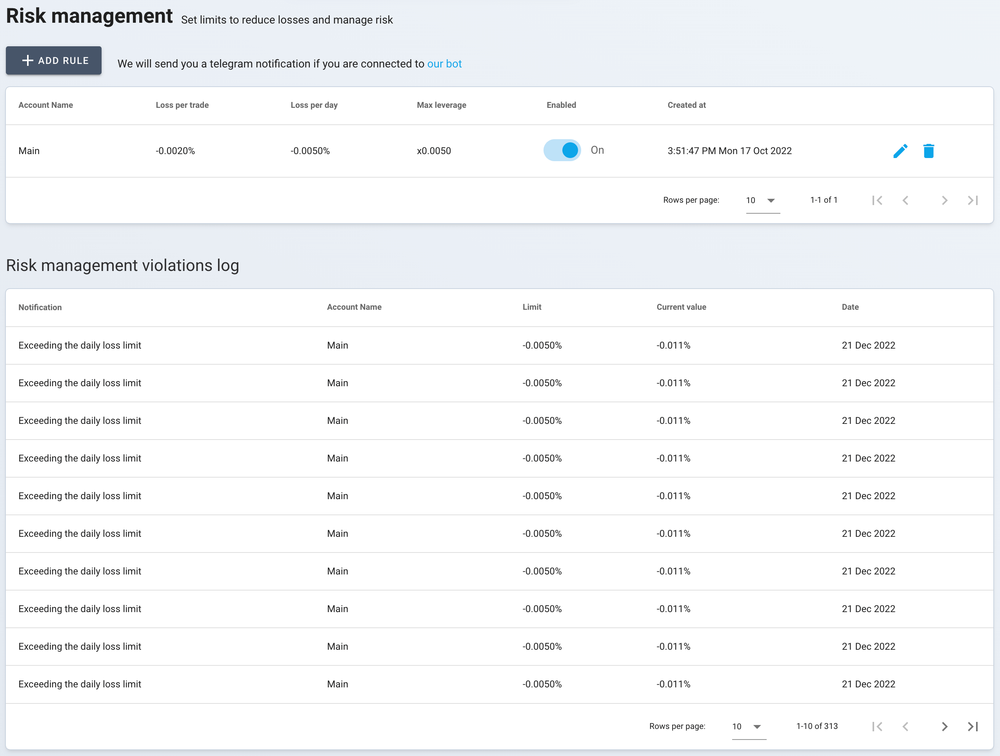
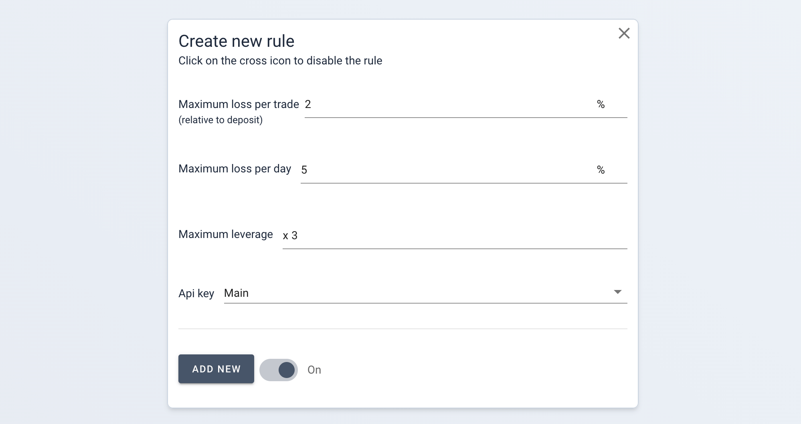

# Risk Management <a target="_blank" href="https://tradermake.money/app2/account/risk-management" class="btn btn-header">Go to risk management</a>

The "Risk Management" section provides a set of tools to help you set and adhere
to specific trading boundaries, ensuring disciplined trading practices.

> **Note**: The system is designed to inform rather than enforce. It will not
> interfere with your ongoing trades on the exchange. It's a prompt for you to
> take action based on the pre-defined rules you've set for risk management.

## Example

<picture> <source srcset="_media/risk-management/rm-dark.png"
    media="(prefers-color-scheme: dark)">  </picture>

## Creating Risk Management Rules

- **Customizable Rules**: Set personalized rules for maximum loss per trade, per
  day, and maximum leverage for each API key.
- **Proactive Notifications**: Get alerted through Telegram if any rule is
  violated, provided you're connected to our bot.
- **Deposit-Based Calculations**: All risk management values are calculated
  relative to the deposit of the selected API key, allowing for rules that adapt
  to your account size.

<picture> <source srcset="_media/risk-management/rm-form-dark.png"
    media="(prefers-color-scheme: dark)">  </picture>

## Violation Log and Alerts

- **Real-time Log**: All rule violations are logged in real time for your
  review.
- **Visual Cues**: Trades that violate rules are marked with a warning triangle
  ⚠️, prompting immediate attention.
