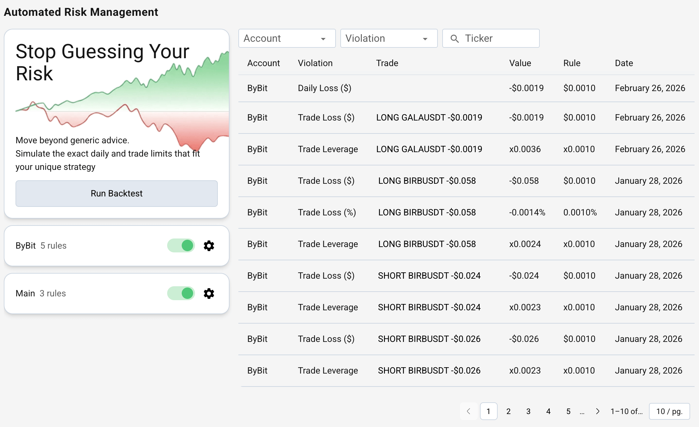
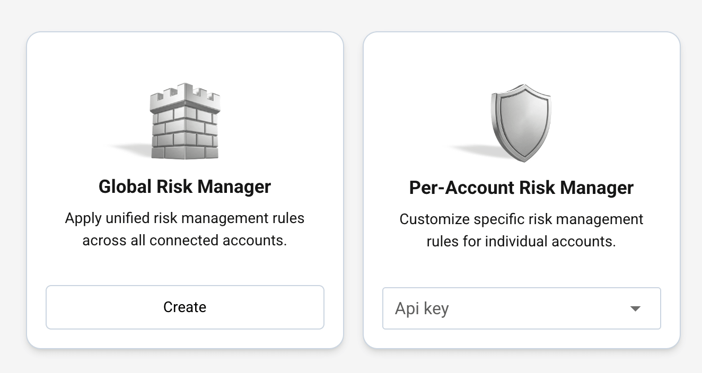
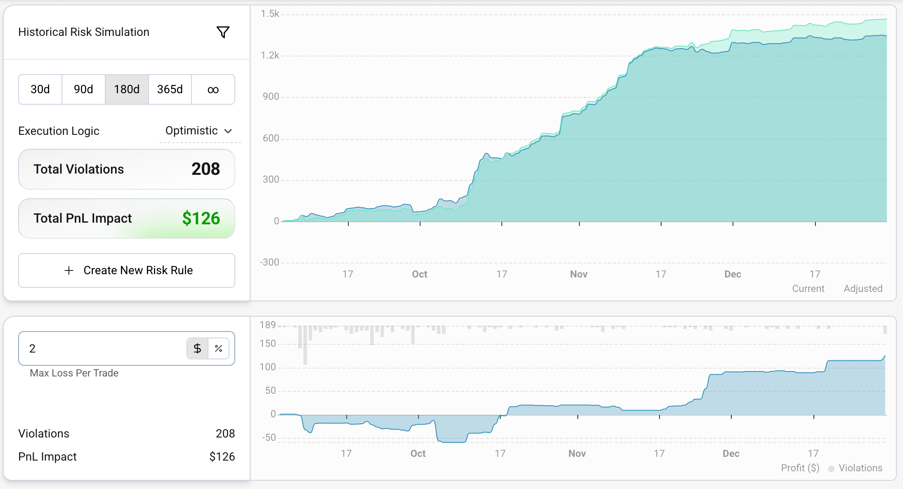
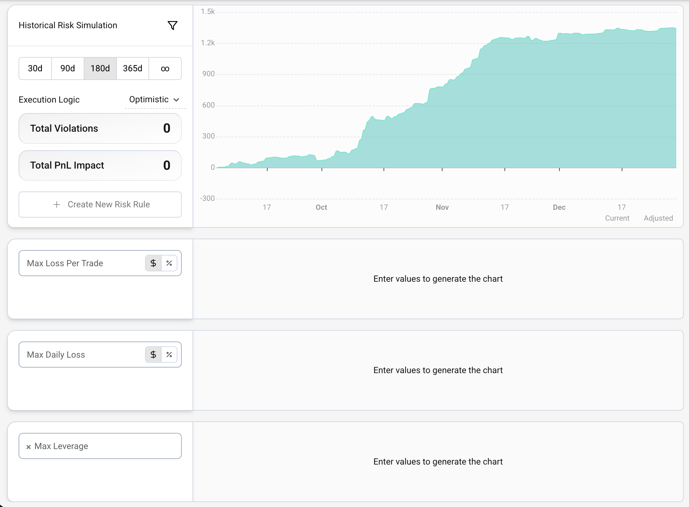
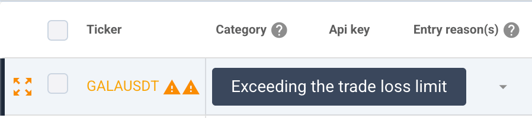

# Risk Management <a target="_blank" href="https://tradermake.money/app2/account/risk-management" class="btn btn-header">Go to risk management</a>

The "Risk Management" section is not just a settings page—it is a research lab for your trading discipline. It provides a sophisticated suite of tools designed to help you define, simulate, and adhere to trading boundaries based on data, not just "gut feeling."

> **Note**: The system is designed to **inform**, not to execute. It will not automatically close positions on the exchange. It acts as a smart monitoring system that alerts you when you deviate from your plan, helping you build internal discipline.

## The Problem: Guessing Your Risk

Most traders pick risk limits arbitrarily (e.g., "I'll risk 1% per trade"). But is 1% optimal for your strategy? Maybe your strategy can handle 2% drawdown, or maybe 0.5% would have saved you from a catastrophic month.

Our **Historical Risk Simulator (Backtester)** solves this by replaying your entire trading history against theoretical rules to show you exactly "what would have happened."

<picture>
  <source srcset="_media/risk-management-v2/rm_overview_dark.png" media="(prefers-color-scheme: dark)">
  
</picture>

---

## How to Use the Risk Simulator

<!-- panels:start -->
<!-- div:left-panel -->

### Step 1: Choose Your Scope
You can test rules on two levels:
1.  **Global Risk Manager**: How would these rules affect your *entire* portfolio combined?
2.  **Per-Account Risk Manager**: Test specific strategies on specific sub-accounts (e.g., testing a tight stop-loss on your "Scalping" account versus a loose one on your "Swing" account).

<!-- div:right-panel -->

<picture>
  <source srcset="_media/risk-management-v2/backtest_step1_dark.png" media="(prefers-color-scheme: dark)">
  
</picture>
<em>Risk manager types</em>

<!-- panels:end -->

<!-- panels:start -->
<!-- div:left-panel -->

### Step 2: Define Your Hypothesis
Enter the limits you want to test. You don't need to enable them yet—just simulate them.

*   **Max Loss Per Trade**: "If I had cut every loser at -$50, how much money would I have saved?"
*   **Max Daily Loss**: "If I had stopped trading for the day after losing 2% of my deposit, would I have avoided that spiral of revenge trading?"
*   **Max Leverage**: "Did high leverage actually increase my profit, or just my fees and losses?"

<!-- div:right-panel -->

<picture>
  <source srcset="_media/risk-management-v2/backtest_input_dark.png" media="(prefers-color-scheme: dark)">
  
</picture>
<em>Backtest input parameters</em>

<!-- panels:end -->

### Step 3: Analyze the Simulation Results
Once you click "Run Backtest", the system analyzes every single trade you've ever made.

<picture>
  <source srcset="_media/risk-management-v2/backtest_overview_dark.png" media="(prefers-color-scheme: dark)">
  
</picture>

#### Understanding the Graph
*   **The Blue Area (Current PnL)**: This is your actual history.
*   **The Green Line (Adjusted PnL)**: This is your equity curve *if you had followed the rules*.

**Interpreting the Results:**
If the Green line is significantly lower than the Blue line, it often means you are **"sitting through" (over-holding) losses**. You allowed a trade to go deep into the red, but it eventually recovered into a profit. A strict risk limit "cuts" these recoveries, showing as a vertical drop on the simulation graph. You can click these points to see which specific days caused the divergence.

#### Execution Logic: Optimistic vs. Realistic
This setting determines how the simulator handles the specific trade that "breaks" your daily limit:

*   **Optimistic**: Assumes you cut the loss *exactly* at your limit. (e.g., Daily limit is $500, you exit at exactly -$500). This assumes perfect execution and pre-calculated trade risks.
*   **Realistic**: Records the *entire* loss of the trade that broke the limit, but ignores all subsequent trades for that day. 

**Pro Tip**: Comparing these two modes usually reveals a massive difference. If the "Realistic" mode is much worse, it proves that "loose" daily limits are far less effective than strictly calculating risk for every individual trade.

---

## Strategy & Best Practices

Based on analysis of hundreds of trader backtests, we recommend this workflow to find your optimal settings:

1.  **Start Small**: Set the time range to the last **90 days** to focus on your recent performance.
2.  **Test Daily Risk First**: Find the "Daily Loss" value that provides the most positive impact on your PnL.
3.  **Refine with Trade Limits**: If adjusting daily risk doesn't help, move to "Max Loss Per Trade" and "Max Leverage."

**What your results mean:**
*   **Negative Impact**: If every rule you test makes your PnL worse, congratulations! It means you already control your risks effectively.
*   **Positive Impact**: If the Green line is higher, you have a "leak" in your strategy (likely revenge trading or over-leveraging) that these rules can fix.

---

## Active Monitoring & Alerts

<!-- panels:start -->
<!-- div:left-panel -->

### Real-Time Violation Log
When you enable a rule, the system begins monitoring your trades in real-time. It does not block you, but it keeps a permanent log of every violation.

*   **Accountability**: Seeing a list of violations forces you to confront your lack of discipline.
*   **Analysis**: Click on any violation to see the specific trade that caused it.

### Telegram Notifications
Connect the [Telegram-bot](telegram-bot.md) to receive instant alerts.
*   *Alert Example*: "⚠️ Daily Loss Limit Exceeded: -$505 (Limit: -$500)."
*   *Action*: This is your cue to walk away from the computer before you do more damage.

### In-App Visuals
Your trade list will also reflect your discipline. Trades that violated your rules are marked with a yellow warning icon ⚠️.

<!-- div:right-panel -->

<picture>
  <source srcset="_media/risk-management-v2/trades_list_example_violation_dark.png" media="(prefers-color-scheme: dark)">
  
</picture>
<em>Violation markers in trade list</em>

<!-- panels:end -->
