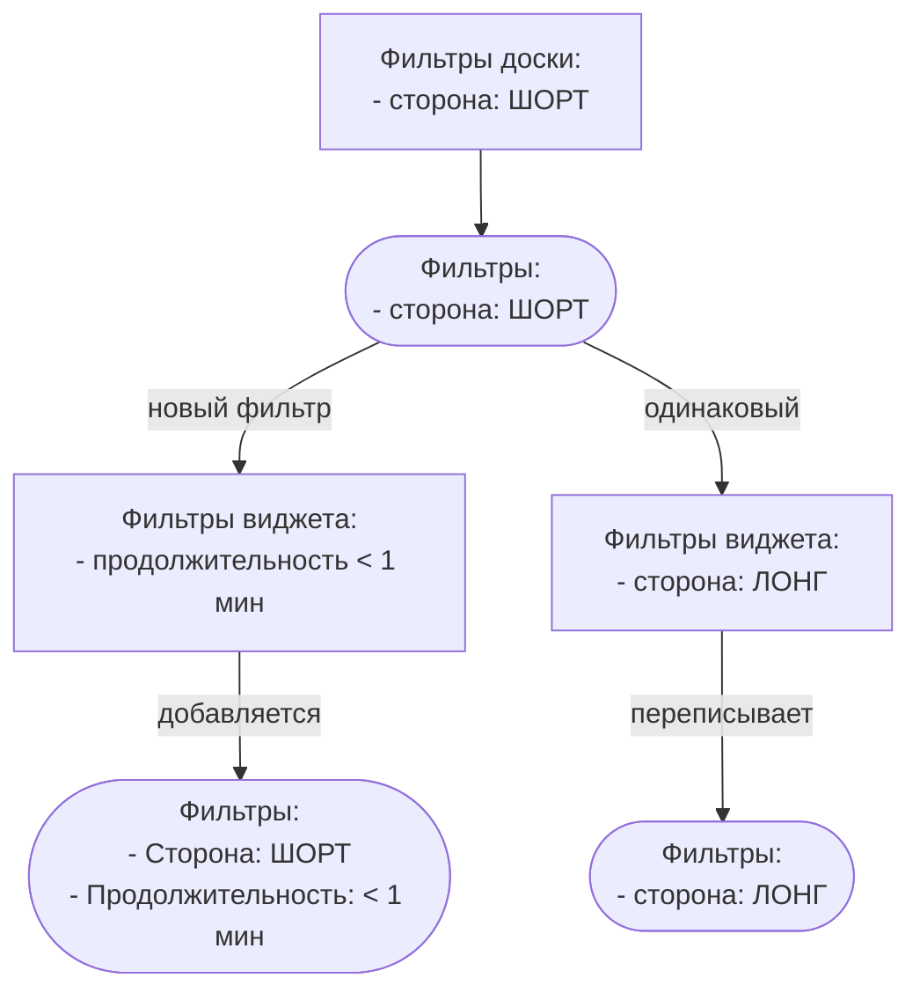

# Понимание Фильтрации Данных

## Суть Фильтров

Фильтры являются ключевым инструментом в анализе сделок как целостных объектов,
без погружения в отдельные ордера. Это особенно важно для понимания многодневных
сделок. Например, сделка, открытая и закрытая в разные дни, по умолчанию покажет
прибыль в день открытия. Этот нюанс подчеркивает важность фильтра "Дата
Группировки". Это поведение также можно изменить в настройках профиля.

## Управление Пресетами Фильтров

<!-- panels:start -->
<!-- div:left-panel -->

### Создание Пресета Фильтра

1. **Установите Ваши Фильтры**: Примените желаемые фильтры в разделе "Сводка"
   или "Мои Сделки".
2. **Сохранить как Пресет**: Нажмите "Сохранить Пресет" и дайте имя вашему
   новому пресету.

<!-- div:right-panel -->

<picture>
    <source srcset="_media/filters/preset-dark.png"
    media="(prefers-color-scheme: dark)"> 
</picture>
<em>Сохранение пресета</em>

<!-- panels:end -->

<!-- panels:start -->
<!-- div:left-panel -->

### Выбор Пресета по умолчанию

- **Выбор пресета**: Рядом с сохраненными пресетами нажмите на значок 'звезды',
  чтобы сделать пресет по умолчанию.
- **Автоматическое Применение**: Пресет будет автоматически применяться каждый
  раз при посещении раздела "Мои сделки".

<!-- div:right-panel -->

<picture>
    <source srcset="_media/filters/favorite-dark.png"
    media="(prefers-color-scheme: dark)"> 
</picture>
<em>Список пресетов</em>

<!-- panels:end -->

Используя пресеты, вы можете быстро получить доступ к предпочтительным
конфигурациям фильтров, делая анализ данных более эффективным.

## Фильтрация в Виджетах

### Иерархическое Применение Фильтров

<!-- panels:start -->
<!-- div:left-panel -->

- **Подход Сверху Вниз**: Настройки, примененные на уровне доски, влияют на все
  виджеты.
- **Индивидуальные переписывание для Виджетов**: Настройки отдельных виджетов
  могут изменить настройки доски.

<!-- div:right-panel -->

<!-- panels:end -->

## Группировка Данных

<!-- panels:start -->
<!-- div:left-panel -->

**Значение по умолчанию:** по дате

Для глобального взгляда на статистику вы можете поставить значение "по неделе"
или "по месяцу".

Если вы хотите анализировать свою торговую эффективность с широкой перспективой,
используйте 'Группировать Данные' по месяцам или неделям для общего обзора.

Если вам требуется детальный анализ для изучения отдельных сделок и паттернов,
группируйте данные по часам или минутам.

> Максимальное количество точек на графике 1000. Если у вас много сделок или
> выбран большой период времени то вы можете уперется в этот лимит при выборе
> группировки по часам или минутам.

<!-- div:right-panel -->

> **Внимание!** Сервис использует часовой пояс, указанный в настройках вашего
> профиля. Если вы хотите, чтобы ваша статистика соответствовала времени биржи,
> пожалуйста, измените свой часовой пояс на UTC.

<!-- panels:end -->

## Дата Открытия/Закрытия Сделки

По умолчанию используется "дата открытия" сделки. Это не всегда удобно, если у
вас есть сделки, длившиеся более 1 дня, так как прибыль будет показана в день
открытия.

Вы можете изменить это в фильтре "Группировка Даты" для каждого виджета отдельно
или в [настройках профиля](/ru/settings.md) для всего аккаунта.

## Настройка

<!-- panels:start -->
<!-- div:left-panel -->

Когда вы наводите курсор мыши на большинство фильтров, справа появляется значок
шестеренки. Нажатие на этот значок активирует ручной режим ввода значения
фильтра.

Значок "=", при нажатии, переключается в режим "≠" и исключает сделки,
попадающие под указанные параметры фильтра.

Некоторые фильтры (например, "Причины Входа") также имеют кнопку "один" / "все".
Если вы выберете "один", будут выбраны сделки с хотя бы одной из выбранных
причин входа. Если выбрано "все", то все причины входа должны присутствовать в
сделке.

<!-- div:right-panel -->

<picture>
    <source srcset="_media/filters/custom-dark.png"
    media="(prefers-color-scheme: dark)"> 
</picture>
<em>Настройка Фильтров</em>

<!-- panels:end -->

## Временные Пресеты

Вы можете выбрать временной период (текущий день, предыдущий день, текущая
неделя, предыдущая неделя, текущий месяц и т.д.). После выбора этого периода вам
больше не нужно его менять. Период будет автоматически обновляться.

Например, если вы выберете текущую неделю, данные будут сбрасываться каждый
понедельник.
