# Settings <a target="_blank" href="https://tradermake.money/app2/settings" class="btn btn-header">Go to settings</a>

The redesigned Settings page provides a centralized hub for all your account preferences, trading configurations, and integrated features. Each block is modular, allowing for quick access and intuitive management.

## Overview

The main settings dashboard gives you a bird's-eye view of your entire account status, from subscription details to active risk rules.

<picture>
  <source srcset="_media/settings-v2/overview_dark.png" media="(prefers-color-scheme: dark)">
  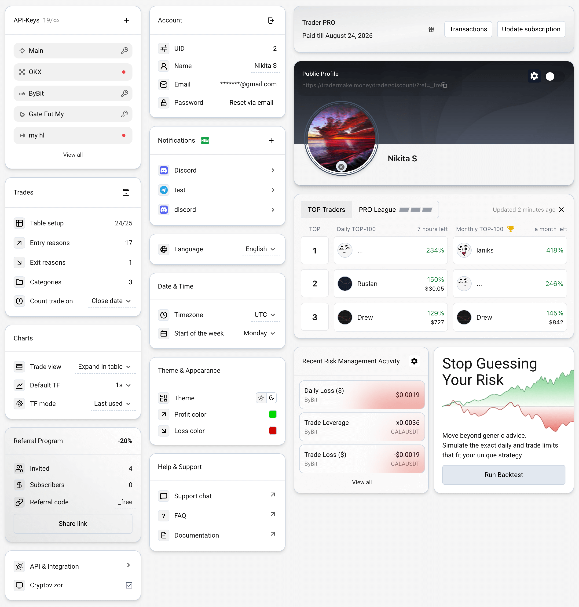
</picture>

---

## Account Details

<!-- panels:start -->
<!-- div:left-panel -->

Manage your personal identity and account security.
- **UID**: Your unique user identifier.
- **Identity**: Manage your displayed name and email address.
- **Security**: Reset your password via email.

<!-- div:right-panel -->

<picture>
  <source srcset="_media/settings-v2/account_dark.png" media="(prefers-color-scheme: dark)">
  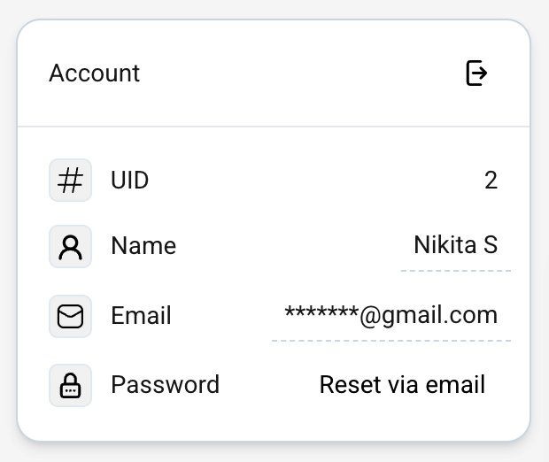
</picture>

<!-- panels:end -->

---

## Subscription

<!-- panels:start -->
<!-- div:left-panel -->

Monitor your current billing status and plan features.
- **Status**: View your current plan (e.g., Trader PRO) and expiration date.
- **Manage**: Access transaction history or upgrade your subscription to unlock more features.

<!-- div:right-panel -->

<picture>
  <source srcset="_media/settings-v2/subscription_dark.png" media="(prefers-color-scheme: dark)">
  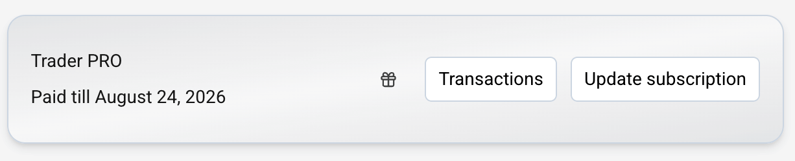
</picture>

<!-- panels:end -->

---

## Trades Table

<!-- panels:start -->
<!-- div:left-panel -->

Customize the core of your trading journal.
- **Archive All**: Click the **folder icon** to move all current trades to the Archive.
- **Table Setup**: Customize column visibility and order for the [My Trades](my-trades.md) section.
- **Management**: Edit [Entry reasons](settings.md#entry-reasons), [Exit reasons](settings.md#exit-reasons), and [Categories](settings.md#categories-setup).
- **Calculation Logic**: Decide if trades are counted on their **Open date** or **Close date**.

<!-- div:right-panel -->

<picture>
  <source srcset="_media/settings-v2/trades_dark.png" media="(prefers-color-scheme: dark)">
  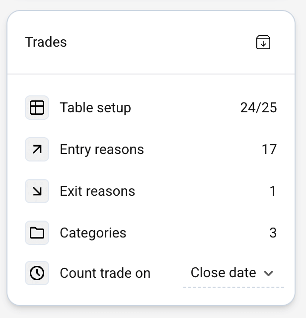
</picture>

<!-- panels:end -->

---

## Charts Configuration

<!-- panels:start -->
<!-- div:left-panel -->

Fine-tune your visual analysis environment.
- **Trade View**: Toggle between **"Expand in table"** and **"Full screen"** (recommended for laptops).
- **Default TF**: Set the floor for your chart timeframes.
- **TF Mode**: Choose between **Adaptive** (auto-adjust) or **Last used** logic.

<!-- div:right-panel -->

<picture>
  <source srcset="_media/settings-v2/charts_dark.png" media="(prefers-color-scheme: dark)">
  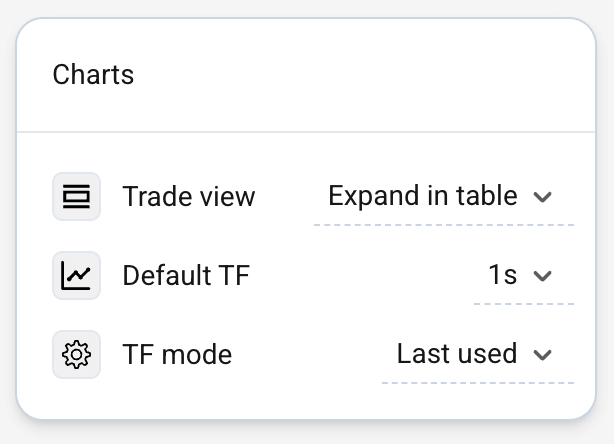
</picture>

<!-- panels:end -->

---

## Language & Timezone

<!-- panels:start -->
<!-- div:left-panel -->

Localize the platform to your region.
- **Language**: Choose your preferred interface language.
- **Timezone**: Set your local time for accurate trade grouping.
- **Calendar**: Define the start of your trading week.

<!-- div:right-panel -->

<picture>
  <source srcset="_media/settings-v2/date_language_dark.png" media="(prefers-color-scheme: dark)">
  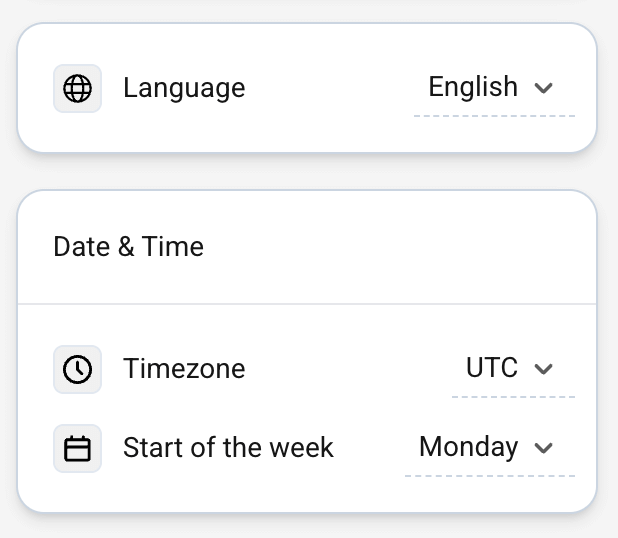
</picture>

<!-- panels:end -->

---

## Theme & Appearance

<!-- panels:start -->
<!-- div:left-panel -->

Personalize the visual aesthetic.
- **Interface Theme**: Switch between Light and Dark modes.
- **Financial Colors**: Customize the colors for profit and loss values.

<!-- div:right-panel -->

<picture>
  <source srcset="_media/settings-v2/theme_appearance_dark.png" media="(prefers-color-scheme: dark)">
  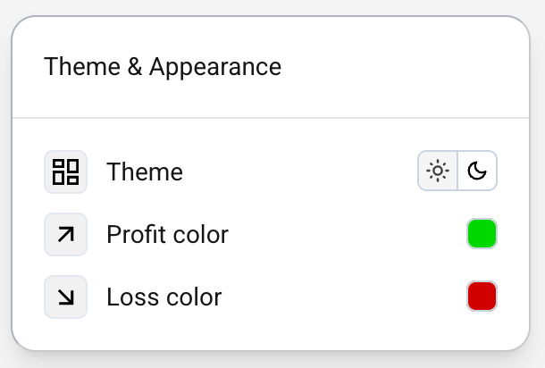
</picture>

<!-- panels:end -->

---

## Public Profile Preview

<!-- panels:start -->
<!-- div:left-panel -->

Quickly toggle and preview your public visibility.
- **Toggle**: Enable or disable your [Public Profile](public-profile.md).
- **Advanced**: Click the gear icon for full profile customization.

<!-- div:right-panel -->

<picture>
  <source srcset="_media/settings-v2/public_profile_preview_dark.png" media="(prefers-color-scheme: dark)">
  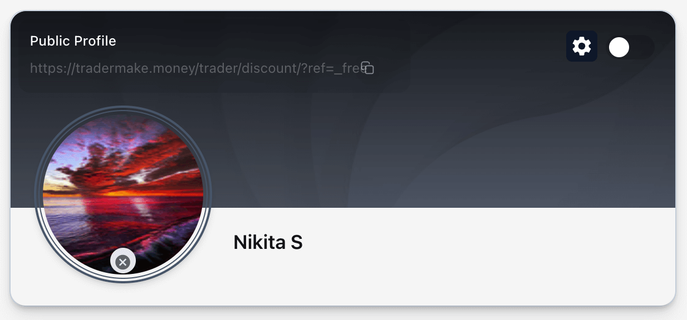
</picture>

<!-- panels:end -->

---

## TOP Traders Preview

<!-- panels:start -->
<!-- div:left-panel -->

Stay informed about the global leaderboard.
- **Status**: View your current standing or the top-performing traders.
- **Hide Block**: Click the **"X" (close) button** in the top right corner if you prefer a distraction-free settings dashboard.

<!-- div:right-panel -->

<picture>
  <source srcset="_media/settings-v2/top_traders_preview_dark.png" media="(prefers-color-scheme: dark)">
  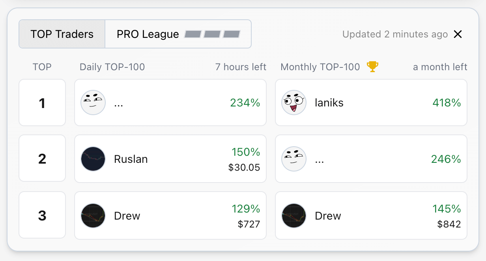
</picture>

<!-- panels:end -->

---

## Risk Management Preview

<!-- panels:start -->
<!-- div:left-panel -->

Monitor your recent risk status and discipline.
- **Overview**: See a summary of recent violations and activity.
- **Simulation**: Quick access to the [Risk Simulation](risk-management.md) lab.

<!-- div:right-panel -->

<picture>
  <source srcset="_media/settings-v2/risk_management_preview_dark.png" media="(prefers-color-scheme: dark)">
  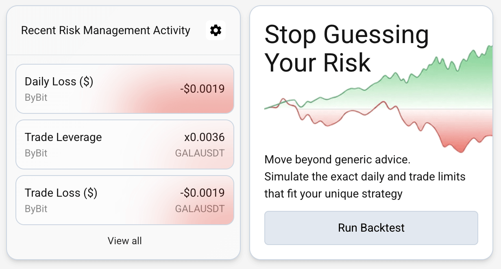
</picture>

<!-- panels:end -->

---

## API Keys

<!-- panels:start -->
<!-- div:left-panel -->

Manage your exchange connections.
- **Visibility**: Only **active** keys are shown here.
- **Repair**: Use the **wrench icon** to fix synchronization issues.

<!-- div:right-panel -->

<picture>
  <source srcset="_media/settings-v2/api_keys_dark.png" media="(prefers-color-scheme: dark)">
  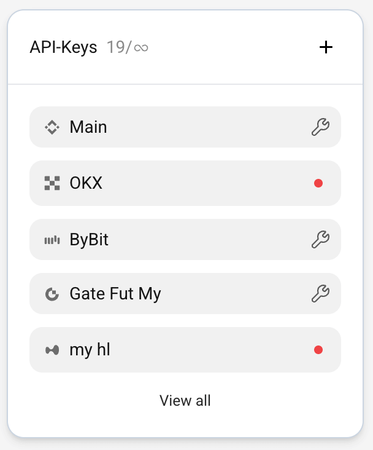
</picture>

<!-- panels:end -->

---

## Notifications

<!-- panels:start -->
<!-- div:left-panel -->

Manage your third-party integrations.
- **Active Connections**: View status of your Telegram and Discord links.
- **New Setup**: Jump into the [Connections](connections.md) wizard to add more.

<!-- div:right-panel -->

<picture>
  <source srcset="_media/settings-v2/notifications_dark.png" media="(prefers-color-scheme: dark)">
  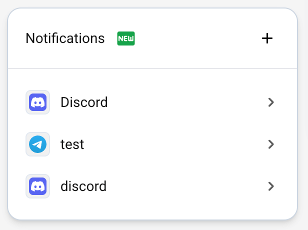
</picture>

<!-- panels:end -->

---

## Referral Program

<!-- panels:start -->
<!-- div:left-panel -->

Invite others and earn subscription rewards.
- **Friend's Benefit**: Your invited friend receives a **20% discount** on their first payment.
- **Your Reward**: You receive **1 month of subscription** as a bonus for the first payment of each invited friend.
- **Once Per Account**: The bonus is granted only once per referred user, regardless of how many times they renew.
- **Fixed Bonus**: You earn 1 month regardless of the friend's payment duration (even for annual plans).
- **Auto-Extension**: Bonuses automatically extend your current subscription status.
- **Status if inactive**: If you don't have a sub, you'll receive **Beginner Plus** (if friend buys basic) or **Trader** (if friend buys Trader/PRO).
- **Cash Withdrawal**: You can request a withdrawal of unused bonuses to your personal wallet by emailing [info@tradermake.money](mailto:info@tradermake.money).

<!-- div:right-panel -->

<picture>
  <source srcset="_media/settings-v2/referral_dark.png" media="(prefers-color-scheme: dark)">
  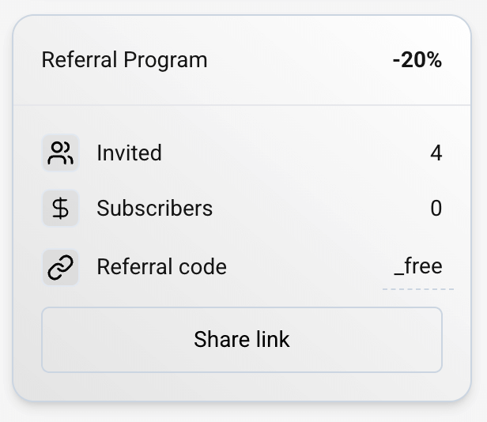
</picture>

<!-- panels:end -->

---

## API & Integration

<!-- panels:start -->
<!-- div:left-panel -->

Advanced settings for power users and external tools.
- **Availability**: This module is available only for users with the **Trader** payment plan or above.
- **Developer API**: Access keys for building your own integrations.
- **Cryptovizor**: Toggle the Cryptovizor service integration.

<!-- div:right-panel -->

<picture>
  <source srcset="_media/settings-v2/api_integration_dark.png" media="(prefers-color-scheme: dark)">
  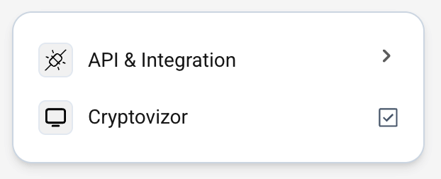
</picture>

<!-- panels:end -->
