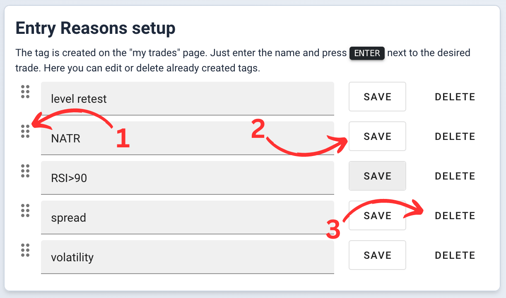

# Settings <a target="_blank" href="https://tradermake.money/app2/account/profile" class="btn btn-header">Go to my profile settings</a>

In this section, you can customize the site to your preference. In addition to
global settings, you can also configure the trade table in the 'My Trades'
section, entry reasons, and categories.

## Example

<!-- panels:start -->
<!-- div:left-panel -->

<picture > <source srcset="_media/profile-settings/main-dark.png"
    media="(prefers-color-scheme: dark)">  </picture>

<!-- div:right-panel -->

1. **Subscription.** Information about the current active subscription.
2. **Profile picture.** A form for uploading a profile picture (used in public
   profiles and top traders list).
3. **The default minimum timeframe on the chart.** Since the timeframe is
   automatically determined by the system depending on the duration of the
   trade, by specifying, for example, a 5-minute timeframe on which you trade,
   you can avoid automatic switching to a 1-minute timeframe for short trades.
4. **Time Zone.** It is used for grouping trades by days, displaying the correct
   entry and exit times in the trade table, etc.
5. **Default Grouping Field**
   [more details](filters.md#trade-openingclosing-date).
6. **Colors** for positive and negative values. Used in the trade table and in
   analytical widgets, if possible.
7. **Archive All Trades.** This button will move all current trades to the
   "archive", effectively clearing the diary. Trades are not deleted and can be
   restored from the archive,
   [more details](my-trades.md#start-from-scratch-archive).

<!-- panels:end -->

## Trades table configuration

<!-- panels:start -->
<!-- div:left-panel -->

<picture > <source srcset="_media/profile-settings/table-dark.png"
    media="(prefers-color-scheme: dark)">  </picture>

<!-- div:right-panel -->

1. Reset to Default Settings
2. **Sorting**. Click and drag to change the order of columns in the table.
3. **Privacy Mode**. Hide data when privacy mode is activated.
4. **Tariff Restrictions**. Indicates that certain data is available only on
   this tariff plan or higher.
5. **Disable Columns**. Click on the cross to disable a column entirely. To
   return the column, click on the plus in the right column.
6. **Color Scheme**. Enable data highlighting for convenient visual analysis.
   Uses colors from profile settings.
7. **Disabled Columns**. The right column displays a list of currently disabled
   columns.

<!-- panels:end -->

## Entry reasons

<!-- panels:start -->
<!-- div:left-panel -->

<picture > <source srcset="_media/profile-settings/tags-dark.png"
    media="(prefers-color-scheme: dark)">  </picture>

<!-- div:right-panel -->

> Create a new entry reason on the "My Trades" page. Enter a new reason and
> press <kbd>Enter</kbd> on the keyboard

1. **Sorting**. The sorting affects the dropdown list of entry reasons when
   selecting in the "My Trades" section.
2. **Save**. After changing the name, click on "save".
3. **Deletion**. Deleting a tag will remove it from all trades on the site.
   **This action is irreversible!**

<!-- panels:end -->

## Categories setup

<!-- panels:start -->
<!-- div:left-panel -->

<picture > <source srcset="_media/profile-settings/categories-dark.png"
    media="(prefers-color-scheme: dark)">  </picture>

<!-- div:right-panel -->

> You cannot delete or modify the "Archive" category.

1. **Sorting**. Sorting affects the dropdown list of categories when selecting
   in filters.
2. **Save**. After changing the name, click on "save".
3. **Deletion**. Deleting a category will remove it from all trades on the site.
   **This action is irreversible!**
4. **Addition**. You can create a category by clicking on the "Add" button.

<!-- panels:end -->
