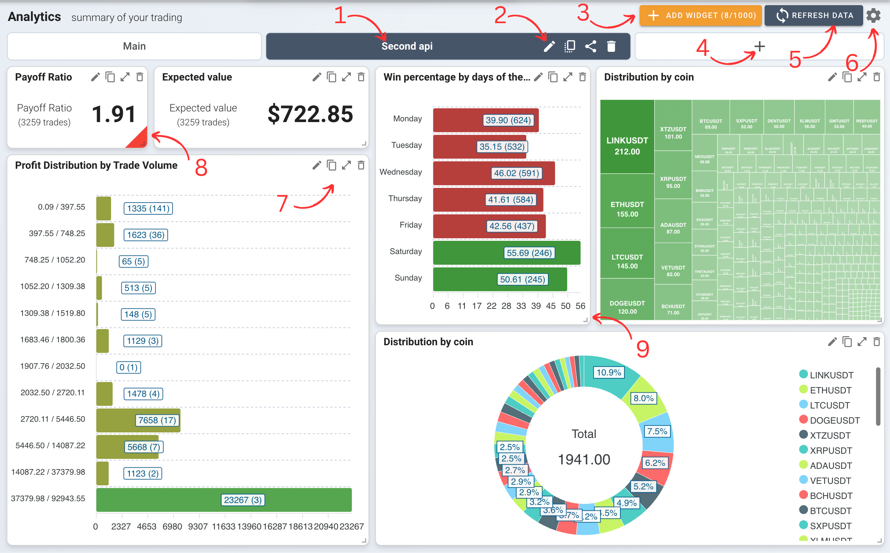
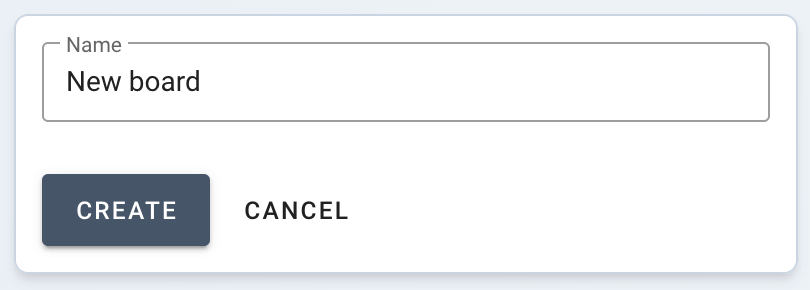
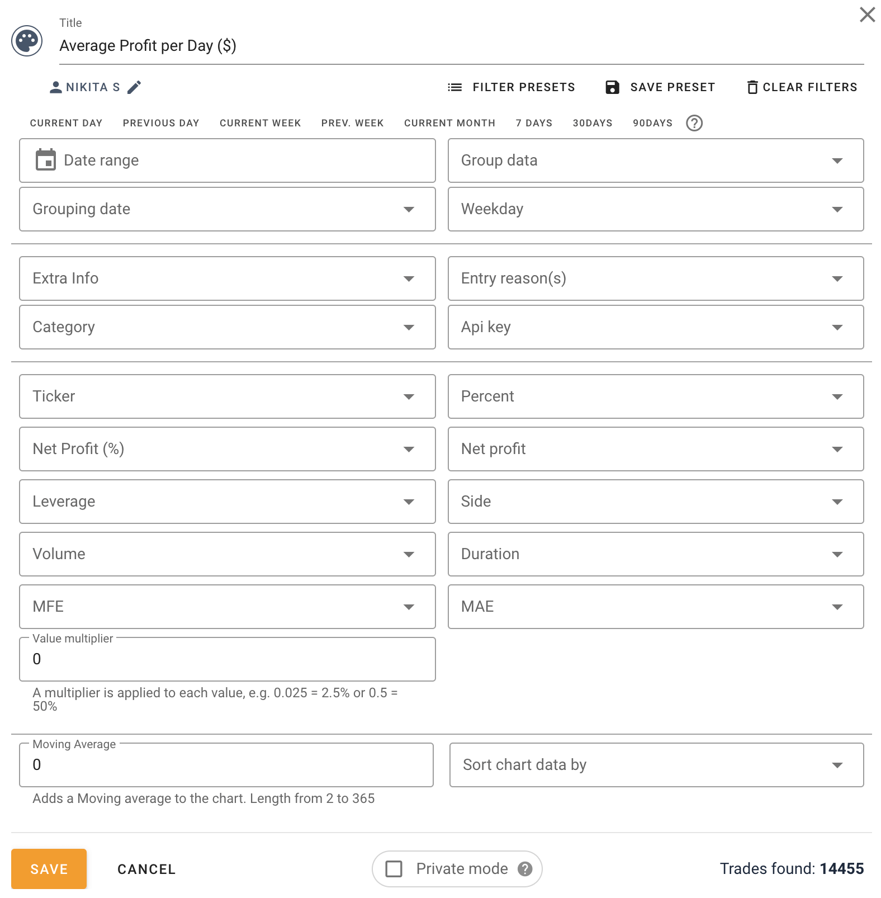
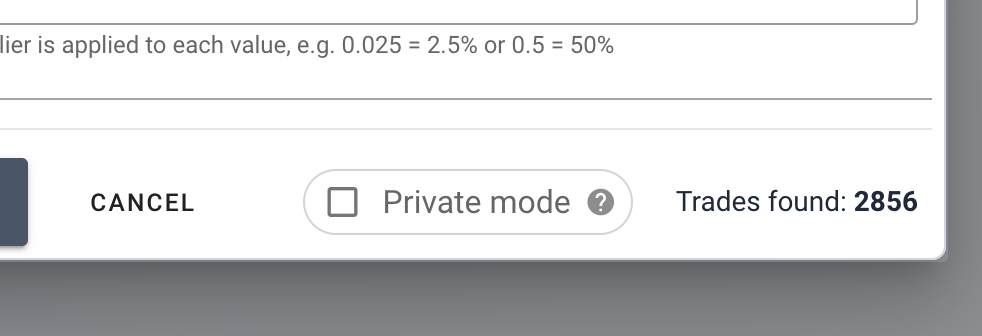
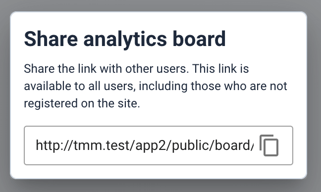
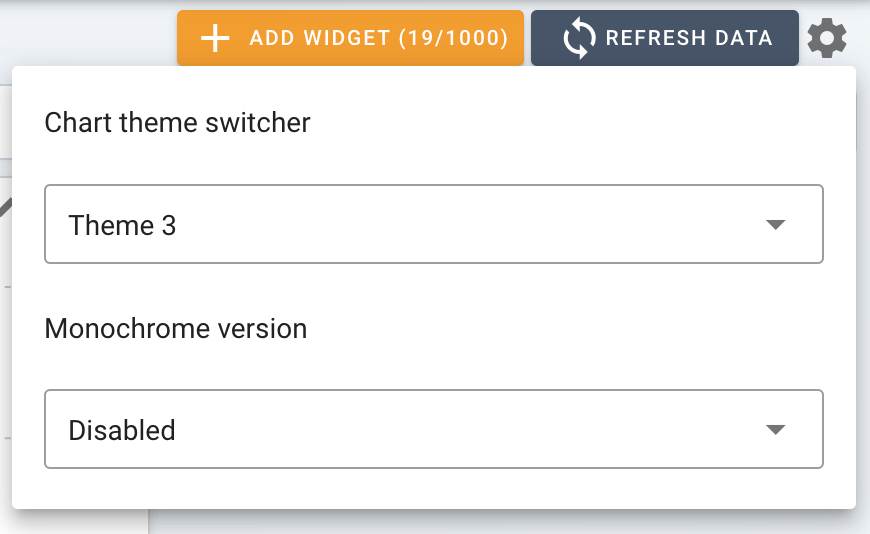
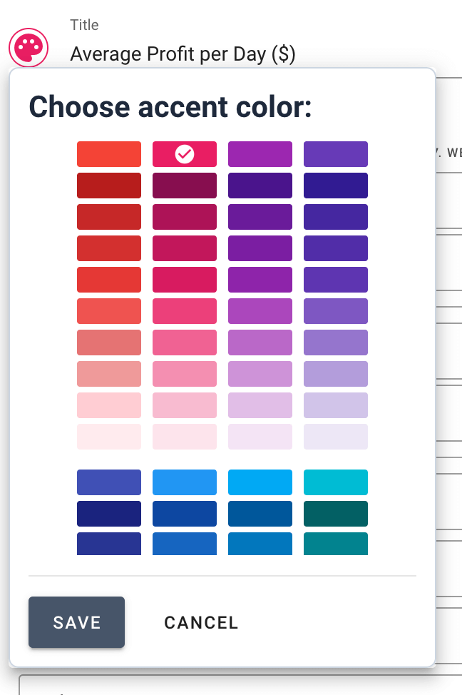

# Summary Section Overview <a target="_blank" href="https://tradermake.money/app2/account/index" class="btn btn-header">Go to summary</a>

Summary section is your comprehensive dashboard for trading analysis and
performance tracking. This section is structured to offer you maximum
flexibility and insight into your trading activities.

- **Dashboards**: Your canvas for creating a personalized dashboard. Each board
  acts as a container for various widgets that display different aspects of your
  trading data.

- **Widgets**: These are the building blocks of your boards. Each widget
  presents specific trading data, ranging from profit charts to detailed
  analytics. Customize each widget to display the exact information you need.

- **Dashboard and Widget Settings**: Fine-tune your experience by adjusting
  settings at both the board and widget levels. While board settings provide a
  general framework, widget settings allow for more granular control, enabling
  you to delve deeper into your data analysis.

This intuitive structure ensures that you have all the tools and flexibility
needed to tailor your dashboard to your unique trading strategy and preferences.

## Example

<picture>
    <source srcset="_media/summary/summary-dark.png" media="(prefers-color-scheme: dark)">
    
</picture>

1. Dashboard name
2. Dashboard actions: filters, dupliate, share, delete
3. Add widget button
4. Create new dashboard
5. Refresh all widgets data
6. Customize widget appearance
7. Widget actions: filters, duplicate, expand, delete
8. Customizable color accent
9. Resize handler

# Customizing Dashboards

### Creating and Managing Boards

<!-- panels:start -->
<!-- div:left-panel -->

Create a new board by clicking the `+` sign next to the existing board tabs.
Enter a name in the prompted dialogue box and click `CREATE`. Manage your boards
through the following icons:

- Pencil: Edit board settings.
- Duplicate: Copy the board with all widgets.
- Share: Generate a public link to the board.
- Trash: Delete the board.

<!-- div:right-panel -->

<picture>
    <source srcset="_media/summary/create-dark.png"
    media="(prefers-color-scheme: dark)"> 
</picture>
<em>Create dashboard form</em>

<!-- panels:end -->

### Adding Widgets

To add widgets, click the `ADD WIDGET` button on your board, select the type of
widget you want, and configure it to display the desired data. The number of
widgets you can add may be limited by your payment plan.

#### Basic Widget Settings

<!-- panels:start -->
<!-- div:left-panel -->

Access basic settings by clicking the pencil icon on the widget. Here you can
set parameters like date range and data groupings. Save your configurations to
update the widget display.

Read [data filtering](filters.md#filtering-in-widgets) section.

<!-- div:right-panel -->

<picture >
    <source srcset="_media/summary/widget-settings-dark.png"
    media="(prefers-color-scheme: dark)"> 
</picture>
<em>Widget settings</em>

<!-- panels:end -->

#### Widget Customization

Each widget can have its settings adjusted, which will override the
corresponding board settings for that widget. This allows for detailed
personalization of data analysis on a per-widget basis.

<!-- ## Data Analysis -->
<!---->
<!-- Read [data filtering](filters.md#filtering-in-widgets) section. -->

<!-- ### Filtering Data -->
<!---->
<!-- Deepen your analysis with filters. Adjust these settings in the widget to -->
<!-- display data that matches specific criteria. Save your filter configurations as -->
<!-- presets for quick application in future analyses. -->
<!---->
<!-- ### Grouping Data -->
<!---->
<!-- The 'Grouping Date' setting allows you to align data visualization with your -->
<!-- trades. By default, data is grouped by the 'Open Time' of trades. For long-term -->
<!-- trades that span multiple days, it is advisable to use the 'Close Time' grouping -->
<!-- to accurately reflect the trade impact on your analytics. -->

## Privacy and Sharing

### Private Mode

<!-- panels:start -->
<!-- div:left-panel -->

When sharing your analytics, you may wish to keep exact numbers confidential.
Enable Private Mode in the widget or board settings to anonymize the data,
showing only relative figures.

<!-- div:right-panel -->

<picture>
    <source srcset="_media/summary/private-dark.png"
    media="(prefers-color-scheme: dark)"> 
</picture>
<em>Private mode</em>

<!-- panels:end -->

### Sharing Dashboards

<!-- panels:start -->
<!-- div:left-panel -->

Create a public link to your dashboard by clicking the share icon, which allows
you to share your analytic insights with others. Link as available for everyone
including guests. To remove link delete the board. Don't forget to duplicate the
board if you need it.

<!-- div:right-panel -->

<picture>
    <source srcset="_media/summary/share-dark.png"
    media="(prefers-color-scheme: dark)"> 
</picture>
<em>Share dashboard</em>

<!-- panels:end -->

## Visual Customization

<!-- panels:start -->
<!-- div:left-panel -->

### Theme Settings

Adjust the visual theme of your charts and widgets for a personalized
experience. Access these settings via the gear icon in the top right corner.
Dark mode users will find monochrome charts enabled by default, with the option
to disable them.

<!-- div:right-panel -->

<picture>
    <source srcset="_media/summary/theme-dark.png"
    media="(prefers-color-scheme: dark)"> 
</picture>
<em>Charts theme selection</em>

<!-- panels:end -->

<!-- panels:start -->
<!-- div:left-panel -->

### Widget Appearance

Customize the appearance of individual widgets to make them more
distinguishable. Use the paint icon in the widget settings to assign colors, and
drag the widget's corner to resize it.

<!-- div:right-panel -->

<picture>
    <source srcset="_media/summary/color-picker-dark.png"
    media="(prefers-color-scheme: dark)"> 
</picture>
<em>Select widget color</em>

<!-- panels:end -->

## Real-Time Updates

### Refreshing Data

Data is calculated in real-time, but widgets require manual refreshing to update
with the latest data. Use the `REFRESH DATA` button to ensure you are viewing
the most current information.

### Automatic Time-Based Updates

Configure widgets to update automatically by setting time presets such as '7
days' or 'Current day'. These widgets will then refresh their data daily to
display the latest information based on the selected time frame.
