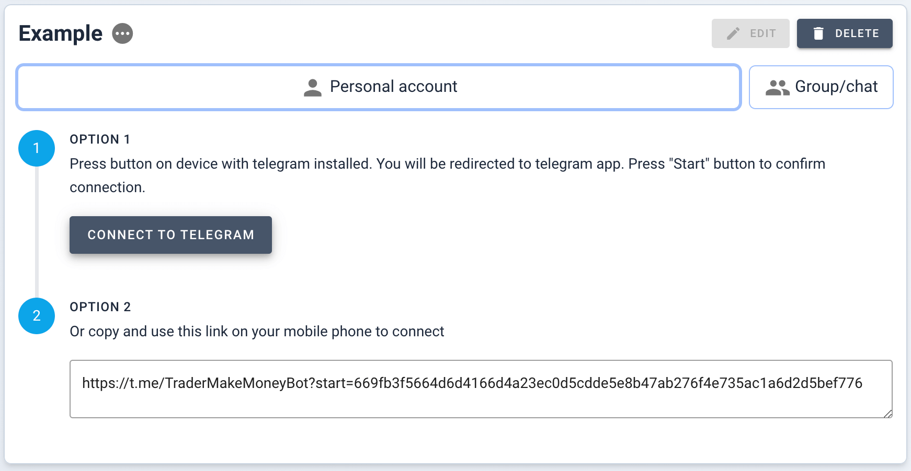
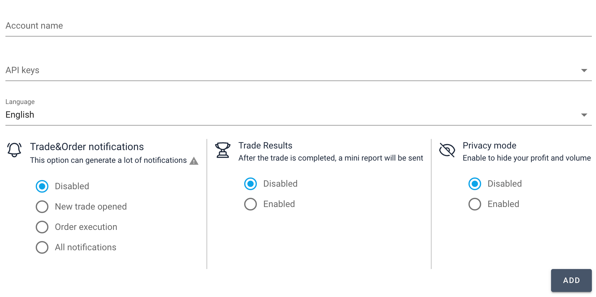
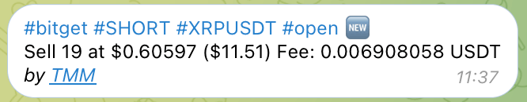
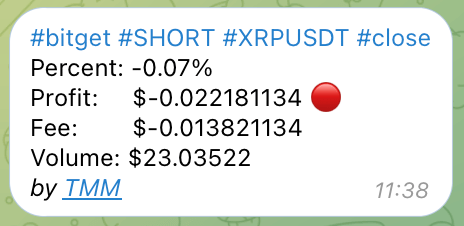
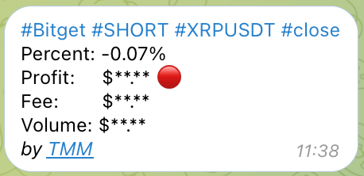
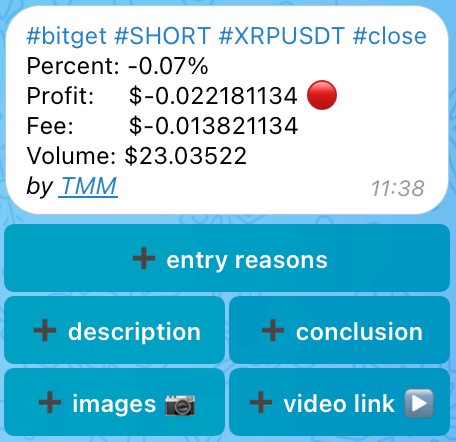
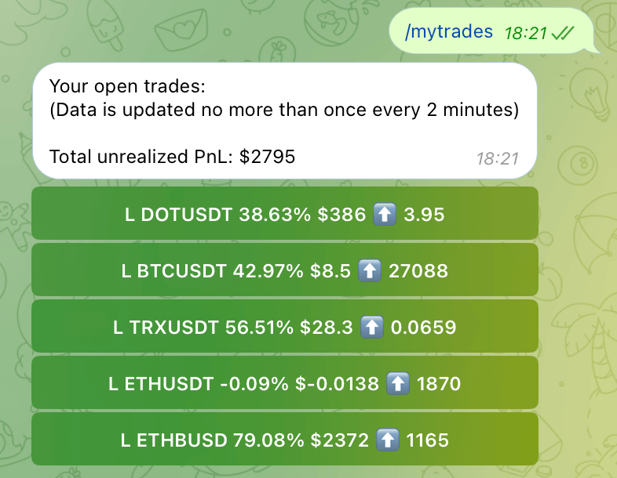
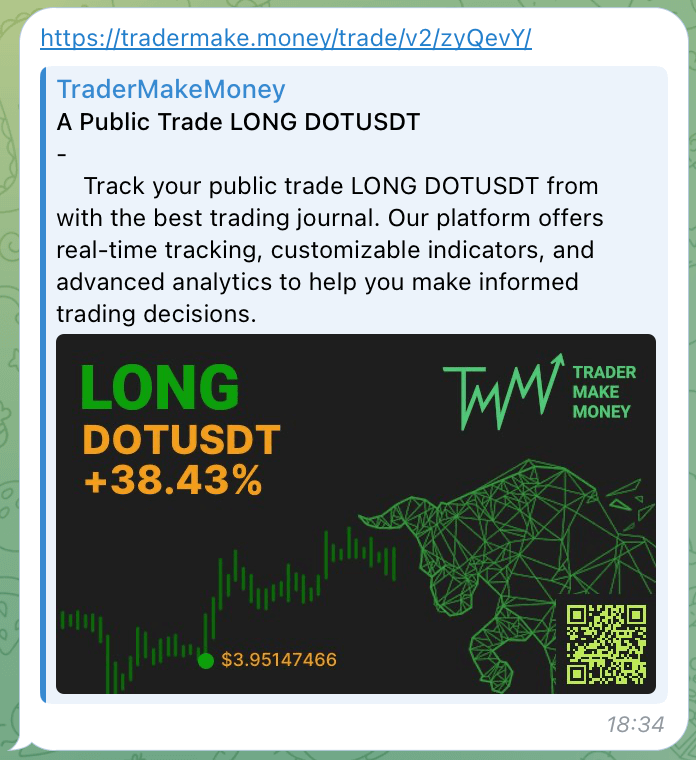
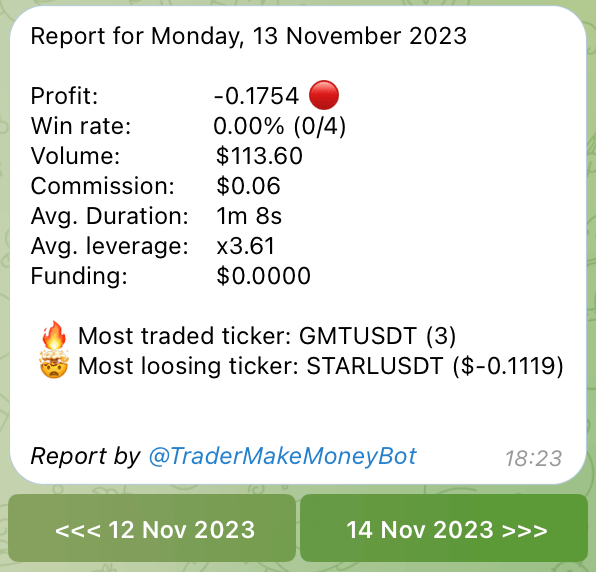
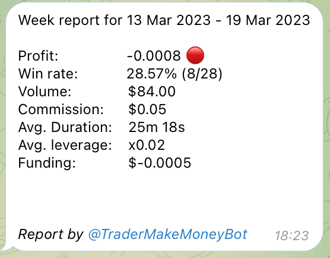

# Telegram Bot <a target="_blank" href="https://tradermake.money/app2/account/telegram" class="btn btn-header">Go to Telegram bot</a>

Stay updated with your trading analytics directly through Telegram.

## Features list

| Feature                                                          | Personal Chat | Group Chat | Min Payment Plan |
| ---------------------------------------------------------------- | :-----------: | :--------: | :--------------: |
| List of currently open positions on exchange                     |      ☑️       |     ➖     |        ➖        |
| Fast day and week report                                         |      ☑️       |     ➖     |        ➖        |
| List of hot (most traded tickers) coins                          |      ☑️       |     ➖     |        ➖        |
| Notifications of opening trade                                   |      ☑️       |     ☑️     |      Trader      |
| Notification of executing each order                             |      ☑️       |     ☑️     |      Trader      |
| Notification of closed trade                                     |      ☑️       |     ☑️     |      Trader      |
| Add entry reasons, description, conclusion, screenshots to trade |      ☑️       |     ➖     |      Trader      |

Connecting to channels not available.

## Personal Account connection

1. Go to the Telegram bot section of the website.
2. Fill in the connection form with your account details and select the desired
   notifications.
3. Click `CREATE CONNECTION` to generate the setup instructions.

#### Instructions for Personal Account Connection

<!-- panels:start -->
<!-- div:left-panel -->

> A maximum of 1 connection can be established with one account in Telegram. If
> you need to replace the connection, you must first delete the old one.

1. Press `CONNECT TO TELEGRAM` on the device with Telegram installed. You'll be
   redirected to the Telegram app or copy and use this link on your mobile phone
   to connect.
2. Follow the prompted instructions until the setup is complete. The connection
   is ready when the instructions disappear.

<!-- div:right-panel -->

<picture > <source srcset="_media/telegram-bot/personal-form-dark.png"
    media="(prefers-color-scheme: dark)">  </picture> <em>Personal
account connection instruction</em>

<!-- panels:end -->

## Group chat connection

<!-- panels:start -->
<!-- div:left-panel -->

Follow these steps to connect your trading account with a Telegram group chat
for instant notifications and updates. Channels are not supported.

> **Remember:** The bot will only send notifications to the group after the
> connection is established and configured properly.
>
> Instruction will disappear after connection established.

<!-- div:right-panel -->

<picture> <source srcset="_media/telegram-bot/chat-form-dark.png"
    media="(prefers-color-scheme: dark)">  </picture> <em>Chat connection
instruction</em>

<!-- panels:end -->

### Step 1: Add the Bot to Your Group

First, you need to add the bot to your Telegram group. Search for the bot’s
username `@TraderMakeMoneyBot` in Telegram and add it to your group.

### Step 2: Set the Bot as Admin

For the bot to function correctly, you must set it as an admin in the group
settings. This allows the bot to read messages and send notifications.

### Step 3: Initiate the Connection

> **Important**: Ensure that you are not using Telegram's anonymous feature to
> send the message. The connection message must be sent from your personal
> Telegram account to establish the link correctly.

Once the bot is an admin, send the following message in your group to initiate
the connection process.

### Step 4: Confirm the Connection

<!-- panels:start -->
<!-- div:left-panel -->

After sending the message, the bot will confirm if the connection is successful.
Ensure that you follow any additional instructions provided by the bot.

<!-- div:right-panel -->

<picture>
    <source srcset="_media/telegram-bot/conn-ready-dark.png"
    media="(prefers-color-scheme: dark)"> 
</picture>
<em>Connection established successfuly</em>

<!-- panels:end -->

## Trade Notifications

<!-- panels:start -->
<!-- div:left-panel -->

Receiving timely notifications helps you keep track of your trades and manage
them more effectively. Notifications works only for selected API keys. Here's
what you can expect:

1. **Trade Opening Notification**: Get alerted when a trade opens, enabling you
   to add details immediately for better tracking.
2. **Order Execution Notification**: Be informed of each order's execution,
   which might lead to multiple messages, so use with discretion.
3. **Trade Closing Notification**: Receive a summary when a trade closes,
   including performance metrics.

<!-- div:right-panel -->

<picture>
    <source srcset="_media/telegram-bot/conn-form-dark.png"
    media="(prefers-color-scheme: dark)"> 
</picture>
<em>Connection form</em>

<!-- panels:end -->

Each notification typically includes:

- **API Key Name**: Identifies the account.
- **Position Side**: Specifies if it's a long or short.
- **Ticker**: The traded asset.
- **Action**: Describes the type of notification - open, execution, or close.

<!-- panels:start -->
<!-- div:left-panel -->

For open and execution actions, the notification details:

- **Action Taken**: Buy or sell.
- **Price**: Execution price.
- **Volume**: Order size.
- **Fee**: Associated fees.
- **PNL**: Profit or loss.
- **Trade Link**: Quick access to the trade (unless privacy mode is on).

<!-- div:right-panel -->

<picture>
    
</picture>
<em>Trade opened</em>

<!-- panels:end -->

<!-- panels:start -->
<!-- div:left-panel -->

Closing notifications provide a concise report:

- **Percent**: Profit or loss percentage.
- **Profit**: Net gain or loss.
- **Fee**: Costs incurred.
- **Volume**: Trade size.
- **Trade Link**: For review and analysis (hidden in privacy mode).

<!-- div:right-panel -->

<picture>
    
</picture>
<em>Trade closed</em>

<!-- panels:end -->

<!-- panels:start -->
<!-- div:left-panel -->

**Privacy Mode**: To ensure discretion, privacy mode can be enabled, which will
conceal profit, volume, fees, and trade links, only showing the API key name and
percentage gain or loss.

<!-- div:right-panel -->

<picture>
    
</picture>
<em>Private notification</em>

<!-- panels:end -->

## Fill in trades

<!-- panels:start -->
<!-- div:left-panel -->

The Telegram bot simplifies adding intricate details to your trades. Here's how
you can utilize it:

1. **Receive Notifications**: After enabling notifications for your selected API
   keys, you'll get updates for each trade. Only in
   [personal](#connecting-to-personal-telegram-account) connection.

2. **Interactive Buttons**: With each notification, you'll find buttons to add:

- Description
- Conclusion
- Entry reasons
- Attach screenshots
- Video link

3. **Adding Content**: Click the button of the detail you want to add. You can
   type in your text or upload images directly.

4. **Synchronization**: The details you input through the bot will be
   synchronized with your trading journal on the platform, providing a
   streamlined experience to maintain an updated and detailed journal.

<!-- div:right-panel -->

<picture>
    
</picture>
<em>Notification example</em>

<!-- panels:end -->

## Commands list

### My trades command

<!-- panels:start -->
<!-- div:left-panel -->

To quickly view your open positions on the exchange, you can use the `/mytrades`
command. Here's what to expect:

- **Position Type**: Whether it's a long or short position.
- **Ticker**: The trading pair or instrument.
- **Floating Percent**: The unrealized profit or loss percentage.
- **Floating PNL**: The unrealized monetary gain or loss.
- **Average Entry Point**: The average price at which the position was opened.

<!-- div:right-panel -->

<picture>
    
</picture>
<em>My trades command example</em>

<!-- panels:end -->

#### Accessing Trade Details

<!-- panels:start -->
<!-- div:left-panel -->

By clicking on a specific trade in the list, you'll receive a public link to
that trade along with an image preview, making it easy to share and discuss with
others.

<!-- div:right-panel -->

<picture>
    
</picture>
<em>Trade preview</em>

<!-- panels:end -->

### Day Report Command

<!-- panels:start -->
<!-- div:left-panel -->

Get a detailed daily trading summary with the `/dayreport` command. This report
includes:

- **Profit/Loss**: Your total profit or loss for the day.
- **Win Rate**: The percentage and count of your winning trades.
- **Trading Volume**: The total value of trades.
- **Commissions Paid**: Fees incurred during trading.
- **Average Trade Duration**: The mean time for each trade.
- **Average Leverage Used**: The typical leverage across your trades.
- **Funding Costs**: Any funding fees accrued.

Additionally, the report highlights your most traded and most losing tickers of
the day. Use the pagination feature to view reports for different days.

<!-- div:right-panel -->

<picture>
    
</picture>
<em>Day report example</em>

<!-- panels:end -->

### Week Report Command

<!-- panels:start -->
<!-- div:left-panel -->

Access a comprehensive summary of your weekly trading performance using the
`/weekreport` command. The flow for accessing the report is as follows:

1. **Select API Key**: Choose a specific API key or opt for 'All API keys' to
   view consolidated data.
2. **Choose the Week**:A list of weeks will be displayed, each with the number
   of trades. Select the week you want to analyze.
3. **View the Report**: After selecting a week, you'll see a detailed report

This report provides insights into profit/loss, win rate, volume, commission,
average duration, leverage used, and funding fees for the selected week.

<!-- div:right-panel -->

<picture>
    
</picture>
<em>Week report example</em>

<!-- panels:end -->
