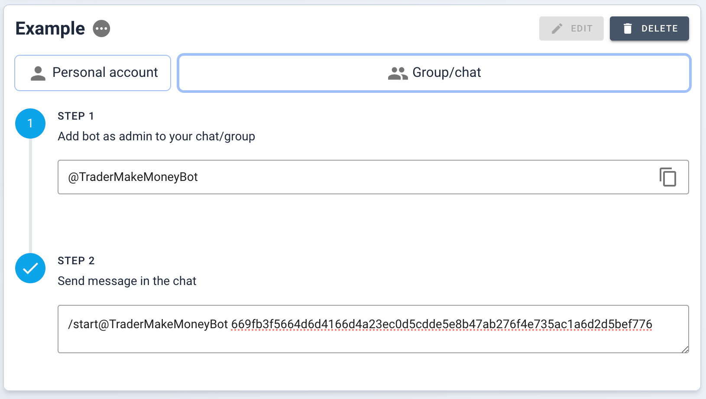
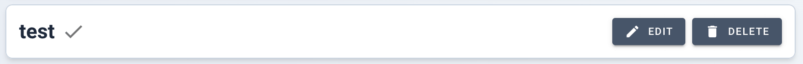

## Telegram Bot

Stay updated with your trading analytics directly through Telegram.

## Features list

| Feature                                                          | Personal Chat | Group Chat | Min Payment Plan |
| ---------------------------------------------------------------- | :-----------: | :--------: | :--------------: |
| List of currently open positions on exchange                     |      ☑️       |     ➖     |        ➖        |
| Fast day and week report                                         |      ☑️       |     ➖     |        ➖        |
| List of hot (most traded tickers) coins                          |      ☑️       |     ➖     |        ➖        |
| Notifications of opening trade                                   |      ☑️       |     ☑️     |      Trader      |
| Notification of executing each order                             |      ☑️       |     ☑️     |      Trader      |
| Notification of closed trade                                     |      ☑️       |     ☑️     |      Trader      |
| Add entry reasons, description, conclusion, screenshots to trade |      ☑️       |     ➖     |      Trader      |

Connecting to channels not available.

## Connecting to Personal Telegram Account

1. Go to the Telegram bot section of the website.
2. Fill in the connection form with your account details and select the desired
   notifications.
3. Click `CREATE CONNECTION` to generate the setup instructions.

#### Instructions for Personal Account Connection

1. Press `CONNECT TO TELEGRAM` on the device with Telegram installed. You'll be
   redirected to the Telegram app or copy and use this link on your mobile phone
   to connect.
2. Follow the prompted instructions until the setup is complete. The connection
   is ready when the instructions disappear.

## Creating a connection with a Chat

<!-- panels:start -->
<!-- div:left-panel -->

Follow these steps to connect your trading account with a Telegram group chat
for instant notifications and updates.
Channels are not supported.

> **Remember:** The bot will only send notifications to the group after the
> connection is established and configured properly.
>
> Instruction will disappear after connection established.

<!-- div:right-panel -->

<picture > <source srcset="_media/telegram-bot/chat-form-dark.png"
    media="(prefers-color-scheme: dark)">  </picture>
<em>Chat connection instruction</em>

    

        delete
    

<!-- panels:end -->

### Step 1: Add the Bot to Your Group

First, you need to add the bot to your Telegram group. Search for the bot’s
username `@TraderMakeMoneyBot` in Telegram and add it to your group.

### Step 2: Set the Bot as Admin

For the bot to function correctly, you must set it as an admin in the group
settings. This allows the bot to read messages and send notifications.

### Step 3: Initiate the Connection

> **Important**: Ensure that you are not using Telegram's anonymous feature to
> send the message. The connection message must be sent from your personal
> Telegram account to establish the link correctly.

Once the bot is an admin, send the following message in your group to initiate
the connection process.

### Step 4: Confirm the Connection

<!-- panels:start -->
<!-- div:left-panel -->

After sending the message, the bot will confirm if the connection is successful.
Ensure that you follow any additional instructions provided by the bot.

<!-- div:right-panel -->

<picture>
    <source srcset="_media/telegram-bot/conn-ready-dark.png"
    media="(prefers-color-scheme: dark)"> 
</picture>
<em>Connection established successfuly</em>

<!-- panels:end -->
