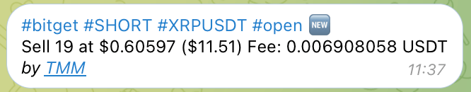
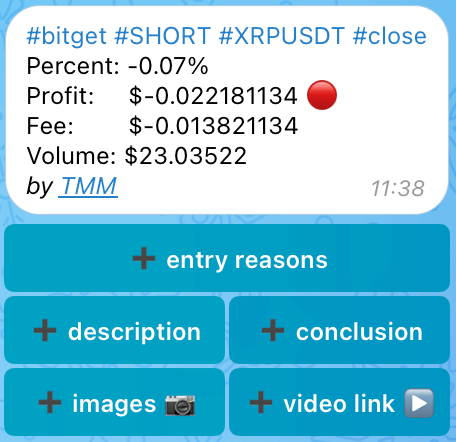
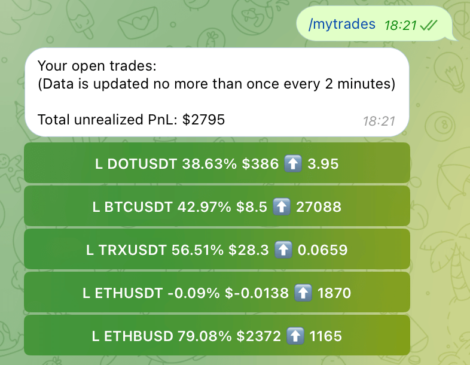
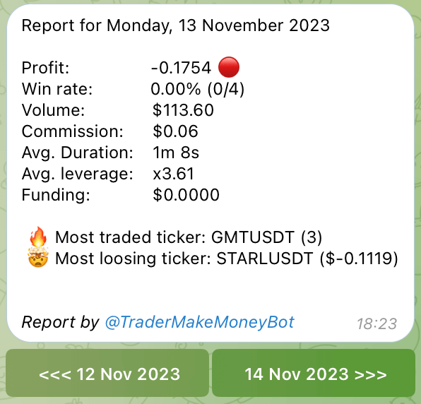
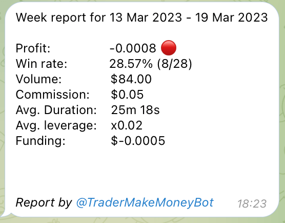

# Telegram Bot <a target="_blank" href="https://tradermake.money/app2/account/telegram" class="btn btn-header">Go to Telegram bot</a>

Stay updated with your trading analytics and receive real-time notifications directly through Telegram.

> **Note**: To receive notifications, you must first set up a connection in the [Connections](connections.md) section.

## Features list

| Feature                                                          | Personal Chat | Group Chat | Min Payment Plan |
| ---------------------------------------------------------------- | :-----------: | :--------: | :--------------: |
| List of currently open positions on exchange                     |      ☑️       |     ➖     |        ➖        |
| Fast day and week report                                         |      ☑️       |     ➖     |        ➖        |
| List of hot (most traded tickers) coins                          |      ☑️       |     ➖     |        ➖        |
| Notifications of opening trade                                   |      ☑️       |     ☑️     |      Trader      |
| Notification of executing each order                             |      ☑️       |     ☑️     |      Trader      |
| Notification of closed trade                                     |      ☑️       |     ☑️     |      Trader      |
| Add entry reasons, description, conclusion, screenshots to trade |      ☑️       |     ➖     |      Trader      |

## Connection Setup

Connecting the Telegram bot is now managed through our unified [Connections](connections.md) system. 

1. Go to the [Connections](connections.md) section.
2. Click **Add Connection** and select **Telegram**.
3. Follow the step-by-step instructions to link your personal account or a group chat.

---

## Trade Notifications

Receiving timely notifications helps you keep track of your trades and manage them more effectively. 

Each notification typically includes:
- **API Key Name**: Identifies the account.
- **Position Side**: Specifies if it's a long or short.
- **Ticker**: The traded asset.
- **Action**: Describes the type of notification - open, execution, or close.

<!-- panels:start -->
<!-- div:left-panel -->

#### Detailed Alerts
For open and execution actions, the notification details:
- **Action Taken**: Buy or sell.
- **Price**: Execution price.
- **Volume**: Order size.
- **PNL**: Profit or loss.
- **Trade Link**: Quick access to the trade (unless privacy mode is on).

<!-- div:right-panel -->

<picture>
    
</picture>
<em>Trade opened notification</em>

<!-- panels:end -->

---

## Filling in Journal via Telegram

<!-- panels:start -->
<!-- div:left-panel -->

The Telegram bot simplifies adding intricate details to your trades directly from your phone.

1. **Interactive Buttons**: With each notification, you'll find buttons to add:
   - Description & Conclusion
   - Entry reasons (Tags)
   - Screenshots
   - Video links
2. **Synchronization**: Everything you input through the bot is instantly synchronized with your trading journal on the web platform.

<!-- div:right-panel -->

<picture>
    
</picture>
<em>Interactive notification buttons</em>

<!-- panels:end -->

---

## Bot Commands

Use these commands in your personal chat with the bot to fetch data on demand.

<!-- panels:start -->
<!-- div:left-panel -->

### /mytrades
View all your currently open positions on the exchange, including floating PnL and average entry points.

<!-- div:right-panel -->

<picture>
    
</picture>
<em>My trades command output</em>

<!-- panels:end -->

<!-- panels:start -->
<!-- div:left-panel -->

### /dayreport
Get a detailed summary of your trading performance for the current day, including win rate, volume, and top/bottom tickers.

<!-- div:right-panel -->

<picture>
    
</picture>
<em>Daily report example</em>

<!-- panels:end -->

<!-- panels:start -->
<!-- div:left-panel -->

### /weekreport
Access a comprehensive summary of your weekly performance. You can select specific API keys and choose which week to analyze.

<!-- div:right-panel -->

<picture>
    
</picture>
<em>Weekly report example</em>

<!-- panels:end -->
